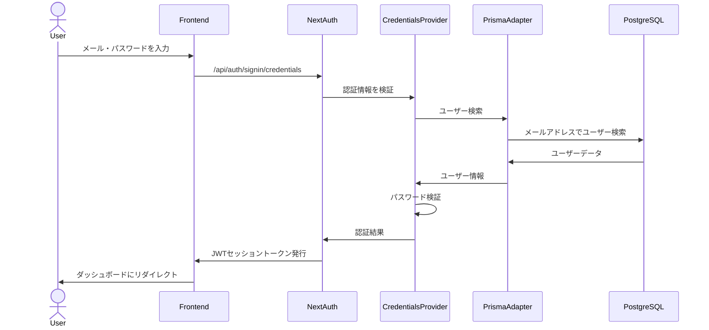
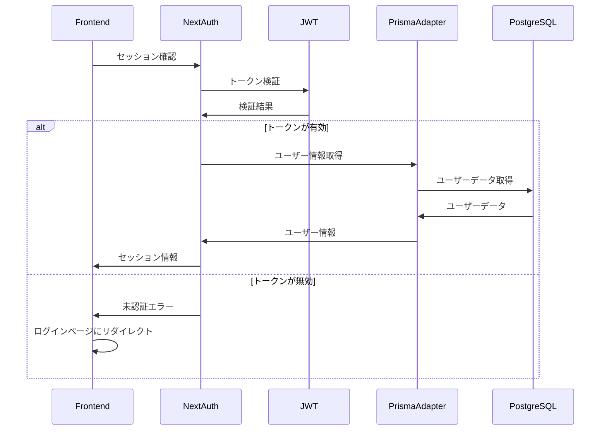
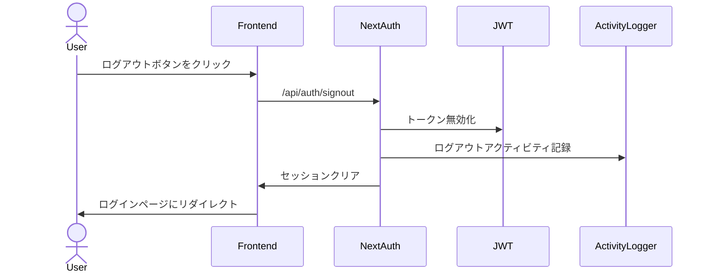

# 認証フローシーケンス図

## メール/パスワード認証フロー

```mermaid
sequenceDiagram
    actor User
    participant Frontend
    participant NextAuth
    participant CredentialsProvider
    participant PrismaAdapter
    participant PostgreSQL

    User->>Frontend: メール・パスワードを入力
    Frontend->>NextAuth: /api/auth/signin/credentials
    NextAuth->>CredentialsProvider: 認証情報を検証
    CredentialsProvider->>PrismaAdapter: ユーザー検索
    PrismaAdapter->>PostgreSQL: メールアドレスでユーザー検索
    PostgreSQL->>PrismaAdapter: ユーザーデータ
    PrismaAdapter->>CredentialsProvider: ユーザー情報
    CredentialsProvider->>CredentialsProvider: パスワード検証
    CredentialsProvider->>NextAuth: 認証結果
    NextAuth->>Frontend: JWTセッショントークン発行
    Frontend->>User: ダッシュボードにリダイレクト
```

## セッション管理フロー

```mermaid
sequenceDiagram
    participant Frontend
    participant NextAuth
    participant JWT
    participant PrismaAdapter
    participant PostgreSQL

    Frontend->>NextAuth: セッション確認
    NextAuth->>JWT: トークン検証
    JWT->>NextAuth: 検証結果
    alt トークンが有効
        NextAuth->>PrismaAdapter: ユーザー情報取得
        PrismaAdapter->>PostgreSQL: ユーザーデータ取得
        PostgreSQL->>PrismaAdapter: ユーザーデータ
        PrismaAdapter->>NextAuth: ユーザー情報
        NextAuth->>Frontend: セッション情報
    else トークンが無効
        NextAuth->>Frontend: 未認証エラー
        Frontend->>Frontend: ログインページにリダイレクト
    end
```

## ログアウトフロー

```mermaid
sequenceDiagram
    actor User
    participant Frontend
    participant NextAuth
    participant JWT
    participant ActivityLogger

    User->>Frontend: ログアウトボタンをクリック
    Frontend->>NextAuth: /api/auth/signout
    NextAuth->>JWT: トークン無効化
    NextAuth->>ActivityLogger: ログアウトアクティビティ記録
    NextAuth->>Frontend: セッションクリア
    Frontend->>User: ログインページにリダイレクト
``` 