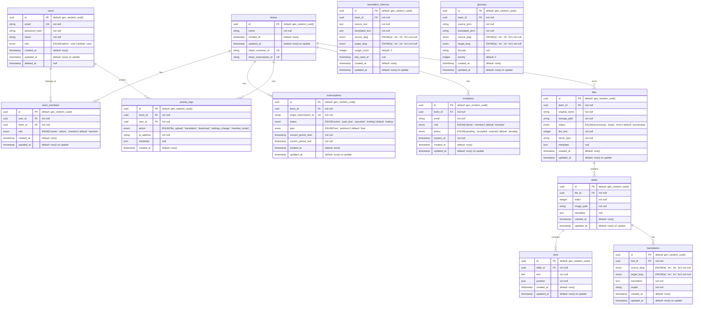

# データベース設計（ER図）

```mermaid
erDiagram
    users ||--o{ team_members : "belongs_to"
    teams ||--o{ team_members : "has"
    teams ||--o{ subscriptions : "has"
    teams ||--o{ activity_logs : "has"
    users ||--o{ activity_logs : "creates"
    teams ||--o{ invitations : "has"
    teams ||--o{ files : "owns"
    files ||--o{ slides : "contains"
    slides ||--o{ texts : "contains"
    slides ||--o{ translations : "has"

    users {
        uuid id PK "default: gen_random_uuid()"
        string email UK "not null"
        string password_hash "not null"
        string name "not null"
        enum role "ENUM('admin', 'user') default: 'user'"
        timestamp created_at "default: now()"
        timestamp updated_at "default: now() on update"
        timestamp deleted_at "null"
    }

    teams {
        uuid id PK "default: gen_random_uuid()"
        string name "not null"
        timestamp created_at "default: now()"
        timestamp updated_at "default: now() on update"
        string stripe_customer_id UK
        string stripe_subscription_id UK
    }

    team_members {
        uuid id PK "default: gen_random_uuid()"
        uuid user_id FK "not null"
        uuid team_id FK "not null"
        enum role "ENUM('owner', 'admin', 'member') default: 'member'"
        timestamp created_at "default: now()"
        timestamp updated_at "default: now() on update"
    }

    subscriptions {
        uuid id PK "default: gen_random_uuid()"
        uuid team_id FK "not null"
        string stripe_subscription_id UK "not null"
        enum status "ENUM('active', 'past_due', 'canceled', 'trialing') default: 'trialing'"
        enum plan "ENUM('free', 'premium') default: 'free'"
        timestamp current_period_start "not null"
        timestamp current_period_end "not null"
        timestamp created_at "default: now()"
        timestamp updated_at "default: now() on update"
    }

    activity_logs {
        uuid id PK "default: gen_random_uuid()"
        uuid team_id FK "not null"
        uuid user_id FK "not null"
        enum action "ENUM('file_upload', 'translation', 'download', 'settings_change', 'member_invite')"
        string ip_address "not null"
        json metadata "null"
        timestamp created_at "default: now()"
    }

    invitations {
        uuid id PK "default: gen_random_uuid()"
        uuid team_id FK "not null"
        string email "not null"
        enum role "ENUM('admin', 'member') default: 'member'"
        enum status "ENUM('pending', 'accepted', 'expired') default: 'pending'"
        timestamp expires_at "not null"
        timestamp created_at "default: now()"
        timestamp updated_at "default: now() on update"
    }

    files {
        uuid id PK "default: gen_random_uuid()"
        uuid team_id FK "not null"
        string original_name "not null"
        string storage_path "not null"
        enum status "ENUM('processing', 'ready', 'error') default: 'processing'"
        integer file_size "not null"
        string mime_type "not null"
        json metadata "null"
        timestamp created_at "default: now()"
        timestamp updated_at "default: now() on update"
    }

    slides {
        uuid id PK "default: gen_random_uuid()"
        uuid file_id FK "not null"
        integer index "not null"
        string image_path "not null"
        json metadata "null"
        timestamp created_at "default: now()"
        timestamp updated_at "default: now() on update"
    }

    texts {
        uuid id PK "default: gen_random_uuid()"
        uuid slide_id FK "not null"
        text text "not null"
        json position "not null"
        timestamp created_at "default: now()"
        timestamp updated_at "default: now() on update"
    }

    translations {
        uuid id PK "default: gen_random_uuid()"
        uuid text_id FK "not null"
        enum source_lang "ENUM('ja', 'en', 'zh', 'ko') not null"
        enum target_lang "ENUM('ja', 'en', 'zh', 'ko') not null"
        text translation "not null"
        string model "not null"
        timestamp created_at "default: now()"
        timestamp updated_at "default: now() on update"
    }

    translation_memory {
        uuid id PK "default: gen_random_uuid()"
        uuid team_id FK "not null"
        text source_text "not null"
        text translated_text "not null"
        enum source_lang "ENUM('ja', 'en', 'zh', 'ko') not null"
        enum target_lang "ENUM('ja', 'en', 'zh', 'ko') not null"
        integer usage_count "default: 0"
        timestamp last_used_at "null"
        timestamp created_at "default: now()"
        timestamp updated_at "default: now() on update"
    }

    glossary {
        uuid id PK "default: gen_random_uuid()"
        uuid team_id FK "not null"
        string source_term "not null"
        string translated_term "not null"
        enum source_lang "ENUM('ja', 'en', 'zh', 'ko') not null"
        enum target_lang "ENUM('ja', 'en', 'zh', 'ko') not null"
        string domain "null"
        integer priority "default: 0"
        timestamp created_at "default: now()"
        timestamp updated_at "default: now() on update"
    }
```