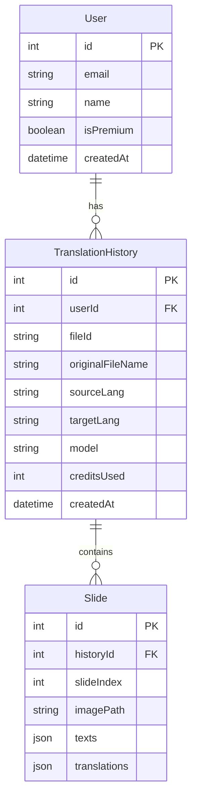

```mermaid
erDiagram
    User {
        int id PK
        string email
        string name
        boolean isPremium
        datetime createdAt
    }
    
    TranslationHistory {
        int id PK
        int userId FK
        string fileId
        string originalFileName
        string sourceLang
        string targetLang
        string model
        int creditsUsed
        datetime createdAt
    }
    
    Slide {
        int id PK
        int historyId FK
        int slideIndex
        string imagePath
        json texts
        json translations
    }
    
    User ||--o{ TranslationHistory : "has"
    TranslationHistory ||--o{ Slide : "contains"
```