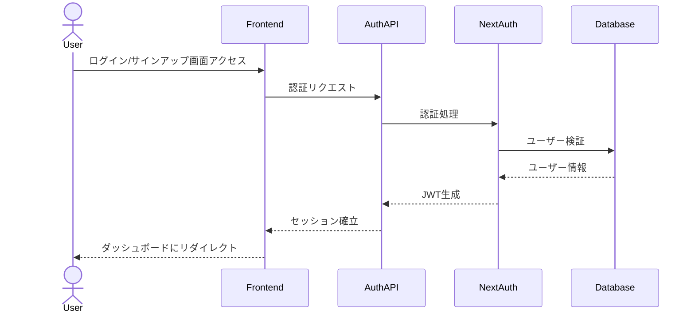
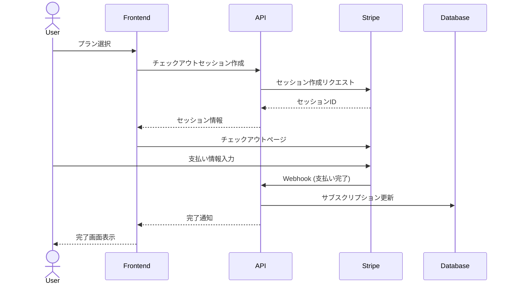
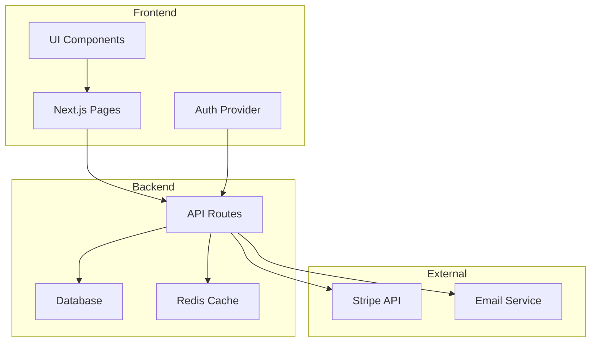
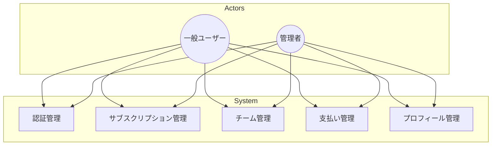
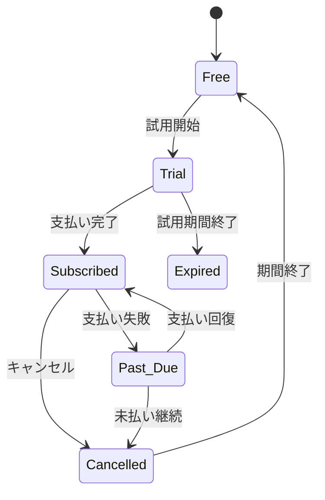
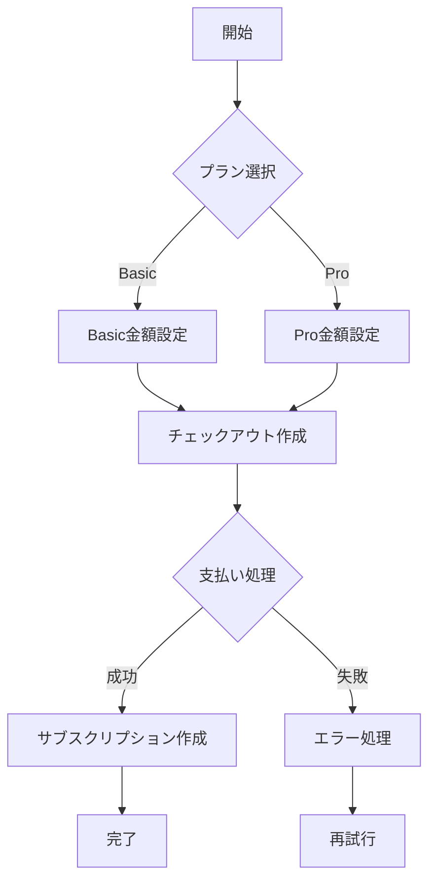
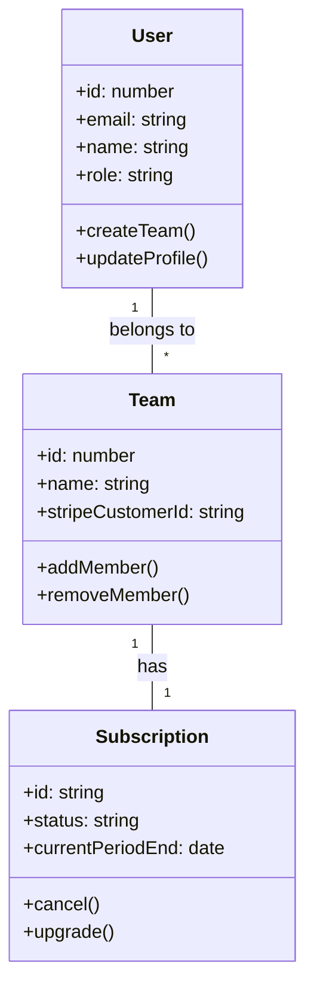
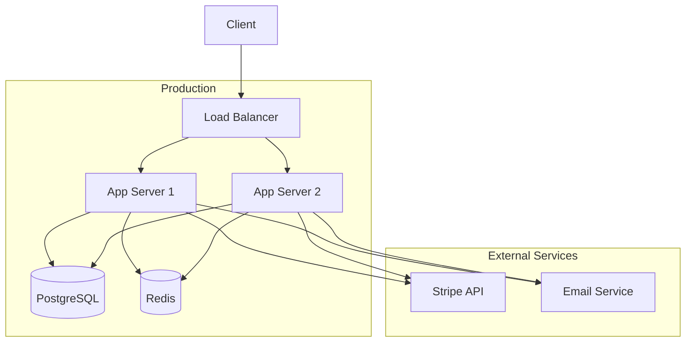
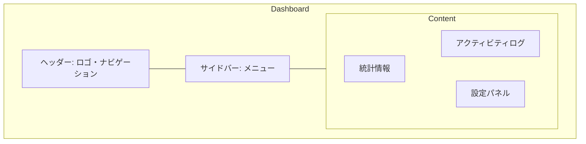

# アプリケーション図解集

## 1. シーケンス図

### 1.1 認証フロー

### 1.2 サブスクリプションフロー

## 2. コンポーネント図

## 3. ユースケース図

## 4. 状態遷移図（サブスクリプション）

## 5. フローチャート（支払い処理）

## 6. クラス図

## 7. インフラストラクチャ図

## 8. ワイヤーフレーム

これらの図解は、アプリケーションの以下の側面を視覚化しています：

1. **シーケンス図**: ユーザー認証とサブスクリプションの処理フロー
2. **コンポーネント図**: アプリケーションの主要構成要素と依存関係
3. **ユースケース図**: システム機能とユーザーの関係
4. **状態遷移図**: サブスクリプションの状態変化
5. **フローチャート**: 支払い処理の具体的な流れ
6. **クラス図**: 主要なモデル間の関係
7. **インフラストラクチャ図**: 本番環境のシステム構成
8. **ワイヤーフレーム**: ダッシュボードのUI構造

これらの図解は、開発チームやステークホルダーがシステムの全体像を理解するのに役立ちます。
