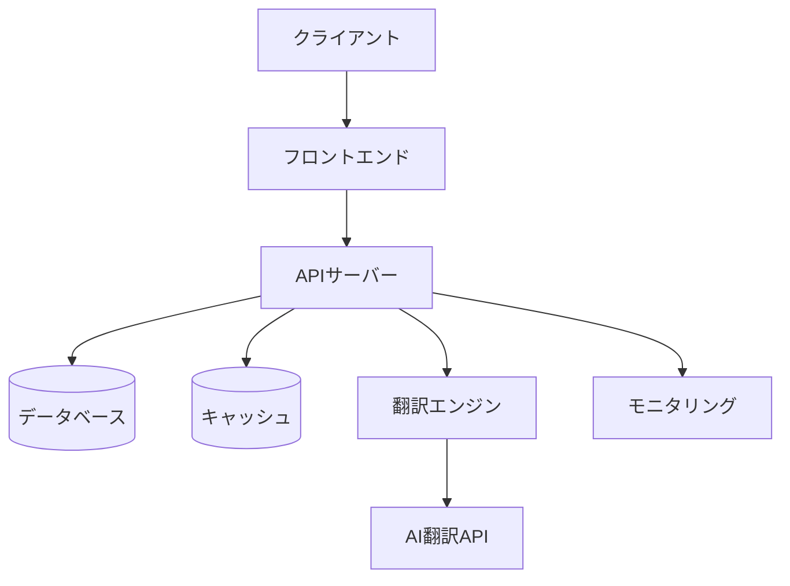

# 実装ガイド

## 概要

このガイドでは、翻訳APIの実装方法と主要なコンポーネントについて説明します。

## アーキテクチャ

システムは以下の主要コンポーネントで構成されています：

1. フロントエンド（Next.js）
2. バックエンドAPI（Next.js API Routes）
3. 翻訳エンジン（Python）
4. データベース（PostgreSQL）
5. キャッシュ（Redis）
6. モニタリングシステム

### システム構成図



## 主要コンポーネント

### 1. 翻訳エンジン

翻訳エンジンは以下の機能を提供します：

- PowerPointファイルのパース
- テキスト抽出
- 翻訳処理
- 書式保持
- ファイル再構築

#### 実装例

```python
from pptx import Presentation
from typing import Dict, List

class TranslationEngine:
    def __init__(self, source_lang: str, target_lang: str):
        self.source_lang = source_lang
        self.target_lang = target_lang
        self.translator = self._init_translator()

    def translate_file(self, file_path: str, options: Dict) -> str:
        presentation = Presentation(file_path)
        
        # スライドの処理
        for slide in presentation.slides:
            self._translate_slide(slide, options)
            
        # 変換したファイルの保存
        output_path = self._generate_output_path(file_path)
        presentation.save(output_path)
        return output_path

    def _translate_slide(self, slide, options: Dict) -> None:
        # テキストの抽出と翻訳
        for shape in slide.shapes:
            if shape.has_text_frame:
                self._translate_text_frame(shape.text_frame)
                
        # ノートの翻訳（オプション）
        if options.get('translate_notes', True):
            self._translate_notes(slide)
```

### 2. キャッシュシステム

キャッシュシステムは翻訳結果とファイル処理の中間状態を保存します：

```typescript
interface CacheOptions {
  ttl: number;
  maxSize: number;
}

class TranslationCache {
  private cache: Map<string, CacheEntry>;
  private options: CacheOptions;

  constructor(options: CacheOptions) {
    this.cache = new Map();
    this.options = options;
  }

  async get(key: string): Promise<CacheEntry | null> {
    const entry = this.cache.get(key);
    if (!entry) return null;
    
    if (this.isExpired(entry)) {
      this.cache.delete(key);
      return null;
    }
    
    return entry;
  }

  async set(key: string, value: any): Promise<void> {
    // キャッシュサイズの管理
    if (this.cache.size >= this.options.maxSize) {
      this.evictOldest();
    }
    
    this.cache.set(key, {
      value,
      timestamp: Date.now()
    });
  }
}
```

### 3. モニタリングシステム

モニタリングシステムは以下の機能を提供します：

- メトリクス収集
- アラート管理
- パフォーマンス監視
- エラー追跡

```typescript
class MetricsCollector {
  private metrics: SystemMetrics;
  private listeners: Set<MetricsListener>;

  constructor() {
    this.metrics = this.initializeMetrics();
    this.listeners = new Set();
    this.startCollecting();
  }

  private async collectMetrics(): Promise<void> {
    // メモリ使用量の収集
    const memoryUsage = process.memoryUsage();
    this.metrics.memory = {
      heapUsed: memoryUsage.heapUsed,
      heapTotal: memoryUsage.heapTotal,
      external: memoryUsage.external,
      arrayBuffers: memoryUsage.arrayBuffers
    };

    // CPU使用率の収集
    const cpuUsage = process.cpuUsage();
    this.metrics.cpu = {
      user: cpuUsage.user,
      system: cpuUsage.system,
      percentage: await this.calculateCPUPercentage()
    };

    // リスナーに通知
    this.notifyListeners();
  }
}
```

## エラーハンドリング

エラーハンドリングは以下の原則に従って実装します：

1. エラーの種類に応じた適切な処理
2. エラーメッセージの多言語化
3. エラーログの収集
4. リトライ処理の実装

```typescript
class ErrorHandler {
  static async handle(error: Error): Promise<void> {
    // エラーの種類を判別
    if (error instanceof NetworkError) {
      await this.handleNetworkError(error);
    } else if (error instanceof ValidationError) {
      await this.handleValidationError(error);
    } else if (error instanceof TranslationError) {
      await this.handleTranslationError(error);
    } else {
      await this.handleUnknownError(error);
    }

    // エラーログの記録
    await this.logError(error);

    // メトリクスの更新
    await this.updateErrorMetrics(error);
  }

  private static async handleNetworkError(error: NetworkError): Promise<void> {
    // リトライ処理
    if (error.retryCount < MAX_RETRIES) {
      await this.retryOperation(error.operation, error.retryCount + 1);
    }
  }
}
```

## パフォーマンスチューニング

パフォーマンス最適化のためのガイドライン：

1. キャッシュの効果的な利用
2. 並行処理の最適化
3. メモリ使用量の管理
4. バッチ処理の実装

```typescript
class PerformanceOptimizer {
  static async optimizeBatchProcessing(jobs: TranslationJob[]): Promise<void> {
    // ジョブのグループ化
    const batches = this.groupJobs(jobs);

    // 並行処理の制御
    const concurrencyLimit = this.calculateConcurrencyLimit();
    
    // バッチ処理の実行
    await Promise.all(
      batches.map(batch => 
        this.processBatchWithLimit(batch, concurrencyLimit)
      )
    );
  }

  private static calculateConcurrencyLimit(): number {
    const availableMemory = os.freemem();
    const cpuCount = os.cpus().length;
    
    return Math.min(
      Math.floor(availableMemory / MIN_MEMORY_PER_JOB),
      cpuCount * 2
    );
  }
}
```

## セキュリティ

セキュリティ対策の実装ガイドライン：

1. 入力バリデーション
2. 認証・認可
3. レート制限
4. ファイルアップロードの制限
5. APIキーの管理

```typescript
class SecurityManager {
  static validateInput(input: any, schema: ValidationSchema): boolean {
    // 入力値の検証
    return schema.validate(input);
  }

  static async authenticateRequest(req: Request): Promise<User> {
    // トークンの検証
    const token = this.extractToken(req);
    return await this.verifyToken(token);
  }

  static async checkRateLimit(userId: string): Promise<boolean> {
    // レート制限のチェック
    const usage = await this.getRateLimit(userId);
    return usage < RATE_LIMIT;
  }
}
```

## デプロイメント

デプロイメントプロセスの概要：

1. ビルドプロセス
2. 環境設定
3. データベースマイグレーション
4. モニタリングの設定
5. バックアップ

```bash
# ビルドプロセス
npm run build

# 環境変数の設定
export NODE_ENV=production
export DATABASE_URL=postgresql://...

# データベースマイグレーション
npx prisma migrate deploy

# アプリケーションの起動
npm run start
```

## トラブルシューティング

一般的な問題と解決方法：

1. メモリリーク
   - ヒープダンプの分析
   - ガベージコレクションの監視

2. パフォーマンス低下
   - プロファイリング
   - ボトルネックの特定

3. エラー発生時
   - ログの確認
   - エラースタックの分析
   - メトリクスの確認

4. データベース問題
   - クエリの最適化
   - インデックスの見直し
   - コネクションプールの調整 