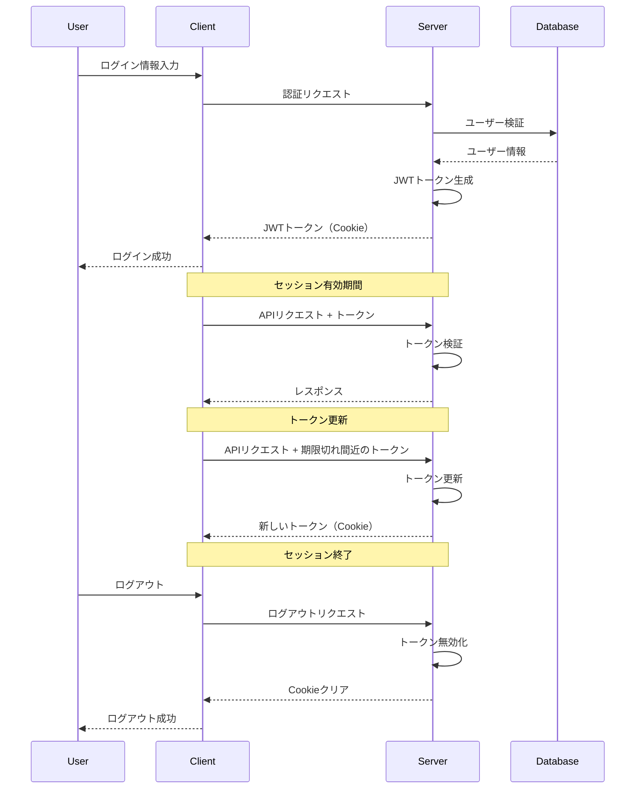

# セキュリティガイド

## 目次

1. [セキュリティ対策の概要](#セキュリティ対策の概要)
   - [認証と認可](#認証と認可)
   - [データ保護](#データ保護)
   - [通信セキュリティ](#通信セキュリティ)
   - [インフラストラクチャセキュリティ](#インフラストラクチャセキュリティ)

2. [セッション管理](#セッション管理)
   - [セッションの仕組み](#セッションの仕組み)
   - [トークン管理](#トークン管理)
   - [セッションハイジャック対策](#セッションハイジャック対策)
   - [CSRF対策](#csrf対策)

3. [脆弱性対策](#脆弱性対策)
   - [XSS対策](#xss対策)
   - [SQLインジェクション対策](#sqlインジェクション対策)
   - [レート制限](#レート制限)
   - [ファイルアップロードセキュリティ](#ファイルアップロードセキュリティ)

4. [監査とログ](#監査とログ)
   - [セキュリティログ](#セキュリティログ)
   - [アクティビティログ](#アクティビティログ)
   - [異常検知](#異常検知)

5. [トラブルシューティング](#トラブルシューティング)
   - [認証問題](#認証問題)
   - [アクセス権限問題](#アクセス権限問題)
   - [セキュリティアラート](#セキュリティアラート)

---

## セキュリティ対策の概要

アプリケーションは、以下のセキュリティ対策を実装しています。

### 認証と認可

- **多要素認証（MFA）**: ユーザーアカウントの保護のため、オプションでMFAを有効にすることができます。
- **ロールベースのアクセス制御（RBAC）**: ユーザーのロールに基づいて、アクセス権限を制御します。
- **セッション管理**: セキュアなセッション管理により、不正アクセスを防止します。
- **パスワードポリシー**: 強力なパスワードを強制し、定期的な変更を促します。

### データ保護

- **データ暗号化**: 保存データと転送中のデータを暗号化します。
- **個人情報保護**: 個人情報は最小限に保持し、適切に保護します。
- **データアクセス制御**: ユーザーは自分のデータにのみアクセスできます。
- **データバックアップ**: 定期的なバックアップにより、データ損失を防止します。

### 通信セキュリティ

- **HTTPS**: すべての通信はHTTPS経由で行われます。
- **HTTP Security Headers**: 適切なセキュリティヘッダーを設定し、ブラウザベースの攻撃を防止します。
- **API保護**: APIはトークンベースの認証で保護されています。
- **WebSocketセキュリティ**: WebSocket接続も認証と暗号化で保護されています。

### インフラストラクチャセキュリティ

- **クラウドセキュリティ**: クラウドプロバイダーのセキュリティベストプラクティスに従っています。
- **コンテナセキュリティ**: コンテナイメージは定期的にスキャンされ、脆弱性がないことを確認しています。
- **ネットワークセキュリティ**: ファイアウォールとネットワークセグメンテーションにより、不正アクセスを防止します。
- **監視とアラート**: 異常な活動を検出し、アラートを発します。

---

## セッション管理

セッション管理は、アプリケーションのセキュリティにおいて重要な役割を果たします。

### セッションの仕組み

アプリケーションは、NextAuth.jsを使用したJWTベースのセッション管理を実装しています。

1. **セッション開始**: ユーザーがログインすると、サーバーはJWTトークンを生成します。
2. **セッション保存**: トークンはHTTP Cookieとして保存されます。
3. **セッション検証**: 各リクエストごとに、トークンの有効性が検証されます。
4. **セッション終了**: ユーザーがログアウトするか、トークンの有効期限が切れると、セッションは終了します。



### トークン管理

トークンは、以下の情報を含みます：

- **ユーザーID**: トークンの所有者を識別します。
- **ユーザーロール**: アクセス権限を決定します。
- **発行時刻**: トークンが発行された時刻です。
- **有効期限**: トークンの有効期限です（デフォルトは1時間）。
- **ユーザーエージェント**: トークンが発行されたデバイスの情報です。

トークンの更新は、以下のように行われます：

1. トークンの有効期限が15分未満になると、自動的に更新されます。
2. 更新されたトークンは、元のトークンと同じユーザー情報を持ちますが、有効期限が延長されます。
3. クライアントは、トークンの更新を意識する必要はありません。すべては自動的に処理されます。

```typescript
// lib/auth/auth-options.ts（抜粋）
callbacks: {
  jwt: async ({ token, user }) => {
    // ユーザー情報がある場合はトークンに追加
    if (user) {
      token.id = user.id;
      token.email = user.email;
      token.name = user.name;
      token.role = user.role;
      token.userAgent = headers().get('user-agent') || '';
      token.iat = Math.floor(Date.now() / 1000);
      token.exp = Math.floor(Date.now() / 1000) + 60 * 60; // 1時間
    }

    // トークンの有効期限をチェック
    const shouldRefreshToken = token.exp && (token.exp - Math.floor(Date.now() / 1000) < 15 * 60); // 15分未満
    
    if (shouldRefreshToken) {
      try {
        // トークンを更新
        token = await refreshToken(token);
      } catch (error) {
        console.error('Token refresh error:', error);
      }
    }

    return token;
  },
}
```

### セッションハイジャック対策

セッションハイジャックを防止するために、以下の対策を実装しています：

1. **ユーザーエージェント検証**: トークンに保存されたユーザーエージェントと、リクエスト時のユーザーエージェントを比較します。
2. **セキュアCookie**: Cookieは`Secure`、`HttpOnly`、`SameSite=Lax`フラグで保護されています。
3. **IP検証**: オプションで、トークンに保存されたIPアドレスと、リクエスト時のIPアドレスを比較します。
4. **短い有効期限**: トークンの有効期限は短く設定されています（デフォルトは1時間）。

```typescript
// lib/auth/auth-options.ts（抜粋）
callbacks: {
  session: async ({ session, token }) => {
    // ユーザーエージェントの検証
    const currentUserAgent = headers().get('user-agent') || '';
    if (token.userAgent && token.userAgent !== currentUserAgent) {
      console.warn('User agent mismatch:', {
        tokenUserAgent: token.userAgent,
        currentUserAgent,
        userId: token.id,
      });
      // セッションを無効化
      return null;
    }

    // セッションにユーザー情報を追加
    if (session.user) {
      session.user.id = token.id as string;
      session.user.role = token.role as string;
    }

    return session;
  },
}
```

### CSRF対策

CSRF（クロスサイトリクエストフォージェリ）攻撃を防止するために、以下の対策を実装しています：

1. **CSRFトークン**: 状態を変更する操作には、CSRFトークンが必要です。
2. **SameSite Cookie**: Cookieは`SameSite=Lax`フラグで保護されています。
3. **Refererチェック**: APIリクエストのRefererヘッダーを検証します。
4. **Content-Type検証**: JSONリクエストのContent-Typeを検証します。

```typescript
// lib/auth/auth-options.ts（抜粋）
cookies: {
  sessionToken: {
    name: `${useSecureCookies ? '__Secure-' : ''}next-auth.session-token`,
    options: {
      httpOnly: true,
      sameSite: 'lax',
      path: '/',
      secure: useSecureCookies,
      maxAge: 60 * 60, // 1時間
    },
  },
  csrfToken: {
    name: `${useSecureCookies ? '__Secure-' : ''}next-auth.csrf-token`,
    options: {
      httpOnly: true,
      sameSite: 'lax',
      path: '/',
      secure: useSecureCookies,
      maxAge: 60 * 60, // 1時間
    },
  },
}
```

---

## 脆弱性対策

アプリケーションは、一般的な脆弱性に対する対策を実装しています。

### XSS対策

XSS（クロスサイトスクリプティング）攻撃を防止するために、以下の対策を実装しています：

1. **入力検証**: ユーザー入力は、サーバー側とクライアント側の両方で検証されます。
2. **出力エスケープ**: ユーザー入力は、表示前に適切にエスケープされます。
3. **Content Security Policy (CSP)**: CSPヘッダーにより、不正なスクリプトの実行を防止します。
4. **HTTPセキュリティヘッダー**: `X-XSS-Protection`ヘッダーにより、ブラウザのXSS保護機能を有効にします。

```typescript
// next.config.js（抜粋）
const securityHeaders = [
  {
    key: 'Content-Security-Policy',
    value: `
      default-src 'self';
      script-src 'self' 'unsafe-inline' 'unsafe-eval';
      style-src 'self' 'unsafe-inline';
      img-src 'self' data: blob:;
      font-src 'self';
      connect-src 'self' ${process.env.NEXT_PUBLIC_API_URL};
    `.replace(/\s+/g, ' ').trim(),
  },
  {
    key: 'X-XSS-Protection',
    value: '1; mode=block',
  },
];
```

### SQLインジェクション対策

SQLインジェクション攻撃を防止するために、以下の対策を実装しています：

1. **ORM使用**: Prismaを使用して、パラメータ化されたクエリを実行します。
2. **入力検証**: データベースクエリに使用される入力は、適切に検証されます。
3. **最小権限**: データベースユーザーは、必要最小限の権限のみを持ちます。
4. **エスケープ処理**: 直接SQLを実行する場合は、入力値を適切にエスケープします。

```typescript
// lib/db/queries.ts（抜粋）
export async function getUserByEmail(email: string) {
  // Prismaはパラメータ化されたクエリを使用するため、SQLインジェクションを防止
  return await prisma.user.findUnique({
    where: { email },
  });
}
```

### レート制限

レート制限により、ブルートフォース攻撃やDoS攻撃を防止します：

1. **IPベースのレート制限**: 同じIPアドレスからの過剰なリクエストを制限します。
2. **ユーザーベースのレート制限**: 同じユーザーからの過剰なリクエストを制限します。
3. **エンドポイント固有のレート制限**: 認証エンドポイントなど、重要なエンドポイントには厳しいレート制限を適用します。
4. **段階的なバックオフ**: 連続した失敗の後、待機時間を増加させます。

```typescript
// middleware.ts（抜粋）
export const config = {
  matcher: ['/api/:path*'],
};

export default async function middleware(req: NextRequest) {
  // レート制限の適用
  const ip = req.ip || '127.0.0.1';
  const rateLimit = await getRateLimit(ip);
  
  if (rateLimit.exceeded) {
    return NextResponse.json({
      error: 'RATE_LIMIT_EXCEEDED',
      message: 'レート制限を超えました。しばらく待ってから再試行してください。',
      timestamp: new Date().toISOString(),
    }, { status: 429 });
  }
  
  return NextResponse.next();
}
```

### ファイルアップロードセキュリティ

ファイルアップロードに関連するセキュリティリスクを軽減するために、以下の対策を実装しています：

1. **ファイルタイプ検証**: アップロードされたファイルのMIMEタイプを検証します。
2. **ファイルサイズ制限**: アップロードされたファイルのサイズを制限します。
3. **ファイル名のサニタイズ**: ファイル名から危険な文字を削除します。
4. **ウイルススキャン**: オプションで、アップロードされたファイルをウイルススキャンします。
5. **安全なストレージ**: ファイルは、直接アクセスできない安全な場所に保存されます。

```typescript
// lib/utils/file-validator.ts（抜粋）
export function validateFile(file: File): { valid: boolean; error?: string } {
  // ファイルタイプの検証
  const allowedTypes = ['application/vnd.openxmlformats-officedocument.presentationml.presentation'];
  if (!allowedTypes.includes(file.type)) {
    return { valid: false, error: '無効なファイル形式です。PPTXファイルのみアップロードできます。' };
  }
  
  // ファイルサイズの検証
  const maxSize = 50 * 1024 * 1024; // 50MB
  if (file.size > maxSize) {
    return { valid: false, error: 'ファイルサイズが大きすぎます。50MB以下のファイルをアップロードしてください。' };
  }
  
  return { valid: true };
}
```

---

## 監査とログ

セキュリティイベントとユーザーアクティビティを監視するために、包括的なログ記録システムを実装しています。

### セキュリティログ

セキュリティログは、セキュリティ関連のイベントを記録します：

1. **認証イベント**: ログイン、ログアウト、パスワードリセットなど。
2. **アクセス制御イベント**: アクセス拒否、権限変更など。
3. **設定変更**: セキュリティ設定の変更。
4. **異常検知**: 不審なアクティビティの検出。

```typescript
// lib/utils/security-logger.ts（抜粋）
export async function logSecurityEvent(event: {
  type: 'AUTH' | 'ACCESS' | 'CONFIG' | 'ANOMALY';
  action: string;
  userId?: string;
  ip?: string;
  userAgent?: string;
  details?: any;
}) {
  try {
    await prisma.securityLog.create({
      data: {
        type: event.type,
        action: event.action,
        userId: event.userId,
        ip: event.ip,
        userAgent: event.userAgent,
        details: event.details ? JSON.stringify(event.details) : null,
        timestamp: new Date(),
      },
    });
  } catch (error) {
    console.error('Security log error:', error);
  }
}
```

### アクティビティログ

アクティビティログは、ユーザーのアクションを記録します：

1. **ファイル操作**: アップロード、ダウンロード、削除など。
2. **翻訳操作**: 翻訳の実行、編集など。
3. **プロフィール操作**: プロフィールの更新など。
4. **管理操作**: ユーザー管理、設定変更など。

```typescript
// lib/utils/activity-logger.ts（抜粋）
export async function logActivity(activity: {
  action: ActivityAction;
  userId: string;
  resourceType?: string;
  resourceId?: string;
  details?: any;
}) {
  try {
    await prisma.activityLog.create({
      data: {
        action: activity.action,
        userId: activity.userId,
        resourceType: activity.resourceType,
        resourceId: activity.resourceId,
        details: activity.details ? JSON.stringify(activity.details) : null,
        timestamp: new Date(),
      },
    });
  } catch (error) {
    console.error('Activity log error:', error);
  }
}
```

### 異常検知

異常検知システムは、不審なアクティビティを検出します：

1. **ログイン異常**: 異常な場所や時間からのログイン。
2. **アクセスパターン**: 通常とは異なるアクセスパターン。
3. **リソース使用**: 異常なリソース使用量。
4. **エラーレート**: 異常に高いエラーレート。

```typescript
// lib/utils/anomaly-detector.ts（抜粋）
export async function detectLoginAnomaly(login: {
  userId: string;
  ip: string;
  userAgent: string;
  timestamp: Date;
}): Promise<boolean> {
  // 過去のログインパターンを取得
  const pastLogins = await prisma.securityLog.findMany({
    where: {
      type: 'AUTH',
      action: 'LOGIN',
      userId: login.userId,
      timestamp: {
        gte: new Date(Date.now() - 30 * 24 * 60 * 60 * 1000), // 過去30日
      },
    },
    orderBy: {
      timestamp: 'desc',
    },
  });
  
  // 異常を検出するロジック
  // ...
  
  return isAnomaly;
}
```

---

## トラブルシューティング

セキュリティ関連の問題を診断し解決するためのガイドです。

### 認証問題

#### 症状: ログインできない

1. **確認事項**:
   - メールアドレスとパスワードが正しいか確認してください。
   - アカウントがロックされていないか確認してください。
   - ブラウザのCookieが有効になっているか確認してください。

2. **解決策**:
   - パスワードリセット機能を使用して、パスワードをリセットしてください。
   - 別のブラウザやデバイスでログインを試みてください。
   - ブラウザのCookieとキャッシュをクリアしてください。

#### 症状: セッションが頻繁に切れる

1. **確認事項**:
   - ブラウザのCookieが有効になっているか確認してください。
   - プライベートブラウジングモードを使用していないか確認してください。
   - 複数のデバイスやブラウザでログインしていないか確認してください。

2. **解決策**:
   - ブラウザのCookieとキャッシュをクリアしてください。
   - 通常モードでブラウザを使用してください。
   - 他のデバイスからログアウトしてください。

### アクセス権限問題

#### 症状: アクセス拒否エラーが表示される

1. **確認事項**:
   - 必要な権限を持っているか確認してください。
   - セッションが有効か確認してください。
   - アカウントが制限されていないか確認してください。

2. **解決策**:
   - 管理者に権限の付与を依頼してください。
   - 再ログインしてください。
   - アカウント制限について管理者に問い合わせてください。

#### 症状: 特定の機能にアクセスできない

1. **確認事項**:
   - サブスクリプションプランに含まれている機能か確認してください。
   - アカウントが有効か確認してください。
   - ブラウザの互換性を確認してください。

2. **解決策**:
   - サブスクリプションプランをアップグレードしてください。
   - アカウントのステータスを確認してください。
   - サポートされているブラウザを使用してください。

### セキュリティアラート

#### 症状: 不審なログイン通知を受け取った

1. **確認事項**:
   - 最近、新しいデバイスやブラウザからログインしたか確認してください。
   - アカウント設定を変更したか確認してください。
   - 不審なアクティビティがないか確認してください。

2. **解決策**:
   - すぐにパスワードを変更してください。
   - 二要素認証を有効にしてください。
   - アクティビティログを確認し、不審なアクティビティがあれば報告してください。

#### 症状: アカウントがロックされた

1. **確認事項**:
   - パスワードを複数回間違えていないか確認してください。
   - 不審なアクティビティが検出されていないか確認してください。
   - アカウントポリシーに違反していないか確認してください。

2. **解決策**:
   - パスワードリセット機能を使用して、パスワードをリセットしてください。
   - サポートに連絡して、アカウントのロック解除を依頼してください。
   - アカウントセキュリティを強化するために、二要素認証を有効にしてください。 