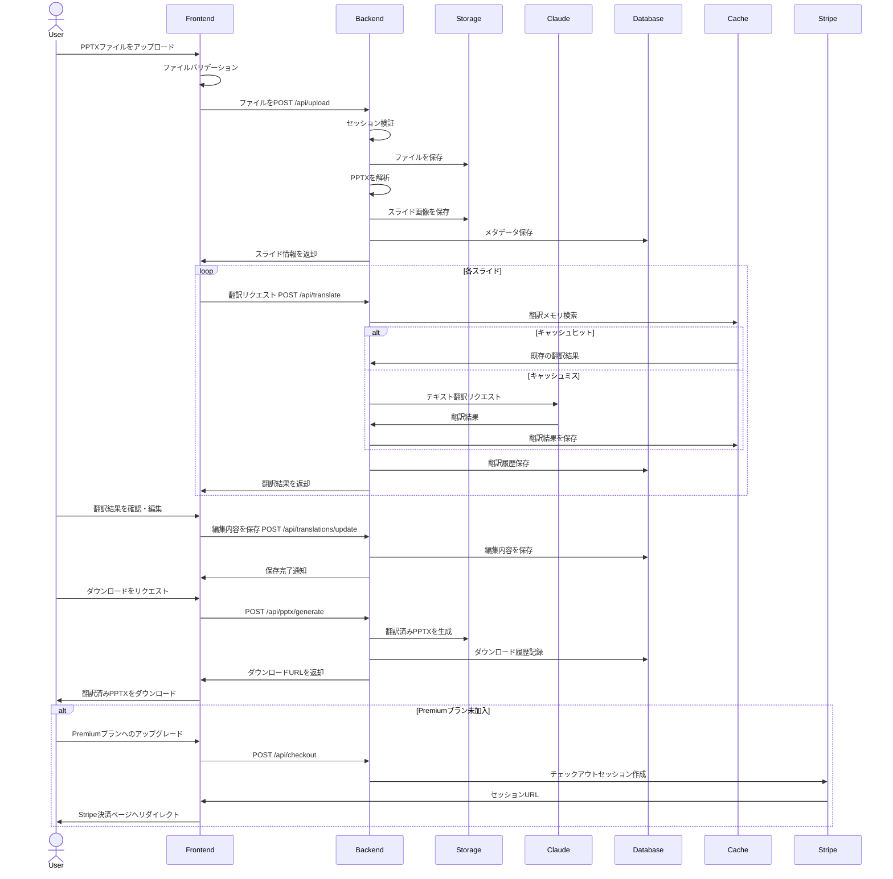
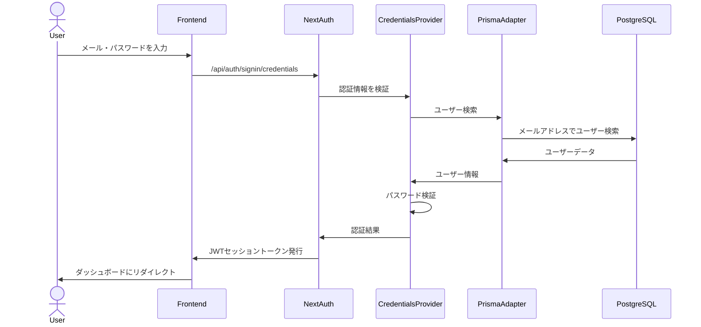
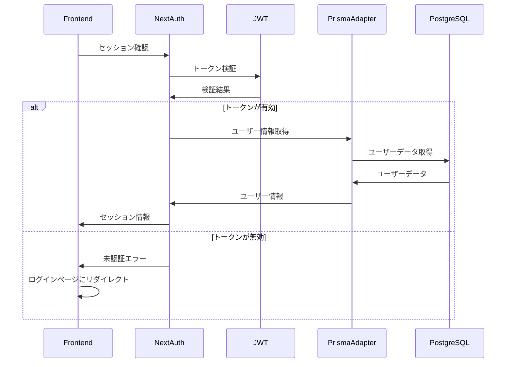
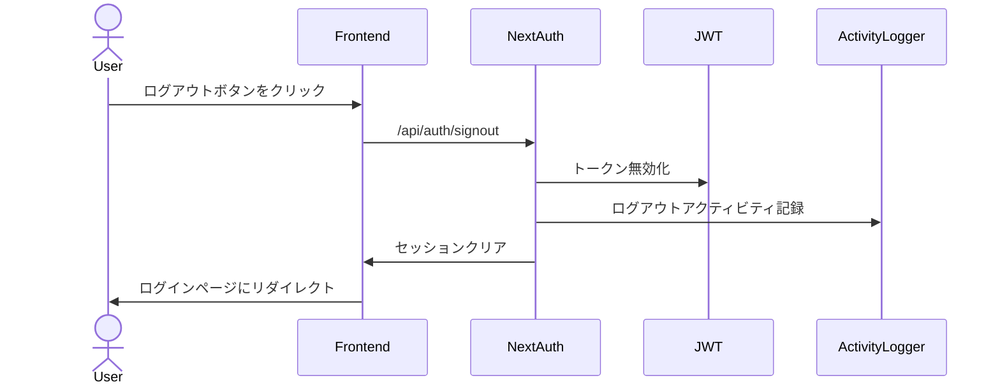
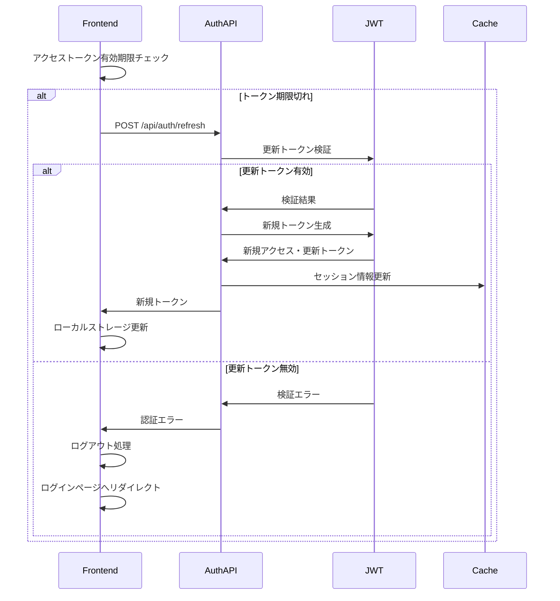
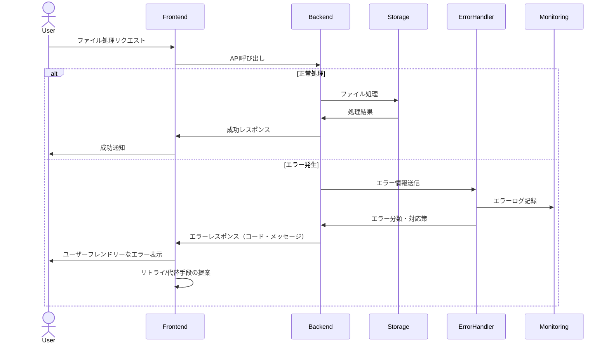
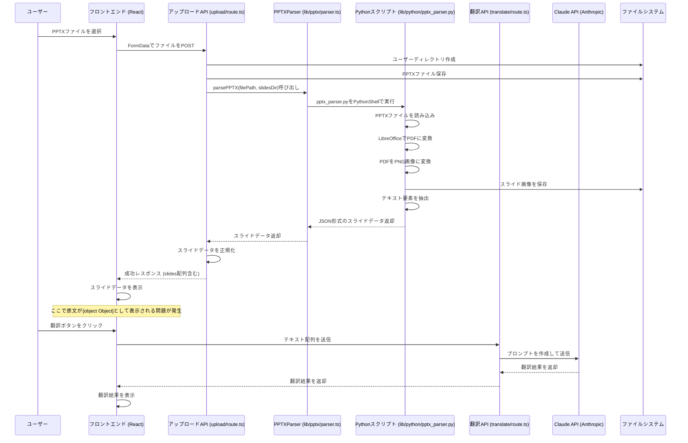

# シーケンス図

## ファイルアップロードと翻訳フロー



## 認証フロー

### メール/パスワード認証フロー



### セッション管理フロー



### ログアウトフロー



## セッション更新フロー



## ファイル処理エラーハンドリングフロー



# PPTXファイルアップロードから翻訳までのシーケンス図と問題分析

## 現在のデータフロー



## 問題分析

現在、スライドの原文が`[object Object]`として表示されている問題が発生しています。コンソール出力とスクリーンショットから、以下の問題点が特定されました：

### 1. データ構造の不一致

フロントエンドのコンポーネント（PreviewSection.tsx）では、スライドのテキストを以下のように表示しています：

```tsx
<p className="text-sm">{slide.texts.join("\n")}</p>
```

しかし、`slide.texts`は文字列の配列ではなく、オブジェクトの配列になっています。型定義（types.ts）では：

```typescript
export interface TextItem {
  text: string;
  position: TextPosition;
}

export interface Slide {
  index: number;
  imageUrl: string;
  texts: TextItem[];  // TextItemオブジェクトの配列
  translations?: TranslationItem[];
}
```

このため、`join()`メソッドを呼び出すと、各オブジェクトはデフォルトの`toString()`メソッドで文字列化され、`[object Object]`として表示されています。

### 2. ログ出力エラー

コンソール出力には以下のエラーも表示されています：

```
File operation logging error: TypeError: Cannot read properties of undefined (reading 'create')
```

これは`logFileOperation`関数内で`prisma.activityLog.create`を呼び出そうとしていますが、`activityLog`が存在しないことを示しています。Prismaスキーマに`ActivityLog`モデルが定義されていないか、正しく生成されていない可能性があります。

## 修正方法

1. **テキスト表示の修正**:
   - PreviewSection.tsxを修正して、オブジェクト配列から文字列を正しく抽出する
   ```tsx
   <p className="text-sm">{slide.texts.map(item => item.text).join("\n")}</p>
   ```

2. **翻訳APIへのデータ送信**:
   - 翻訳APIにテキストを送信する際に、オブジェクトではなく文字列を送信するよう修正

3. **Prismaスキーマの修正**:
   - `ActivityLog`モデルをPrismaスキーマに追加するか、ログ機能を一時的に無効化 