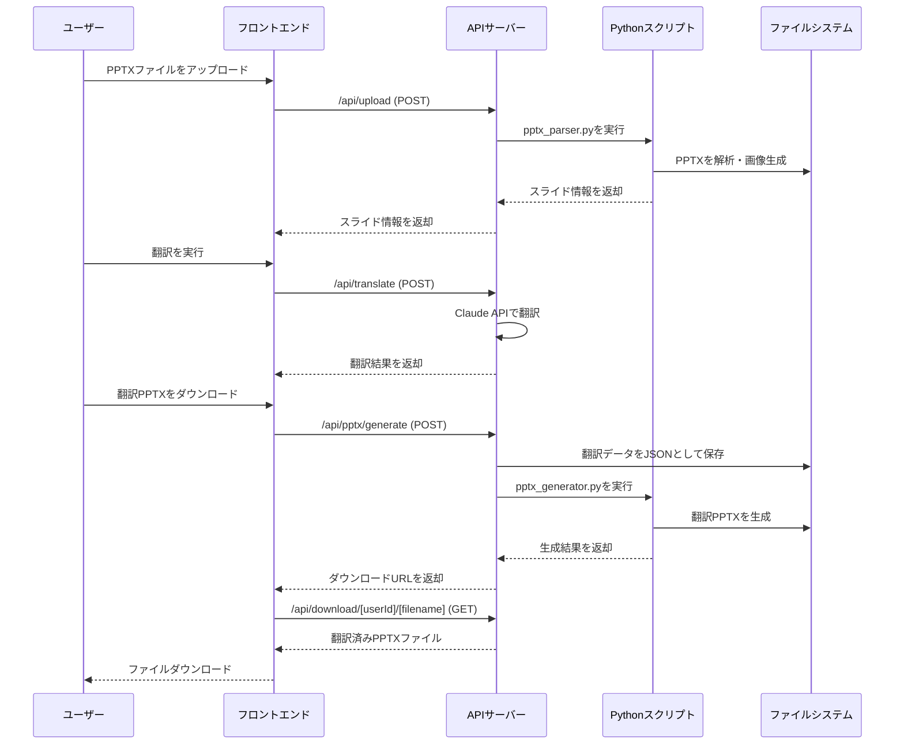

```mermaid
sequenceDiagram
    participant User as ユーザー
    participant Frontend as フロントエンド
    participant API as APIサーバー
    participant Python as Pythonスクリプト
    participant FileSystem as ファイルシステム

    User->>Frontend: PPTXファイルをアップロード
    Frontend->>API: /api/upload (POST)
    API->>Python: pptx_parser.pyを実行
    Python->>FileSystem: PPTXを解析・画像生成
    Python-->>API: スライド情報を返却
    API-->>Frontend: スライド情報を返却

    User->>Frontend: 翻訳を実行
    Frontend->>API: /api/translate (POST)
    API->>API: Claude APIで翻訳
    API-->>Frontend: 翻訳結果を返却

    User->>Frontend: 翻訳PPTXをダウンロード
    Frontend->>API: /api/pptx/generate (POST)
    API->>FileSystem: 翻訳データをJSONとして保存
    API->>Python: pptx_generator.pyを実行
    Python->>FileSystem: 翻訳PPTXを生成
    Python-->>API: 生成結果を返却
    API-->>Frontend: ダウンロードURLを返却
    Frontend->>API: /api/download/[userId]/[filename] (GET)
    API-->>Frontend: 翻訳済みPPTXファイル
    Frontend-->>User: ファイルダウンロード
``` 