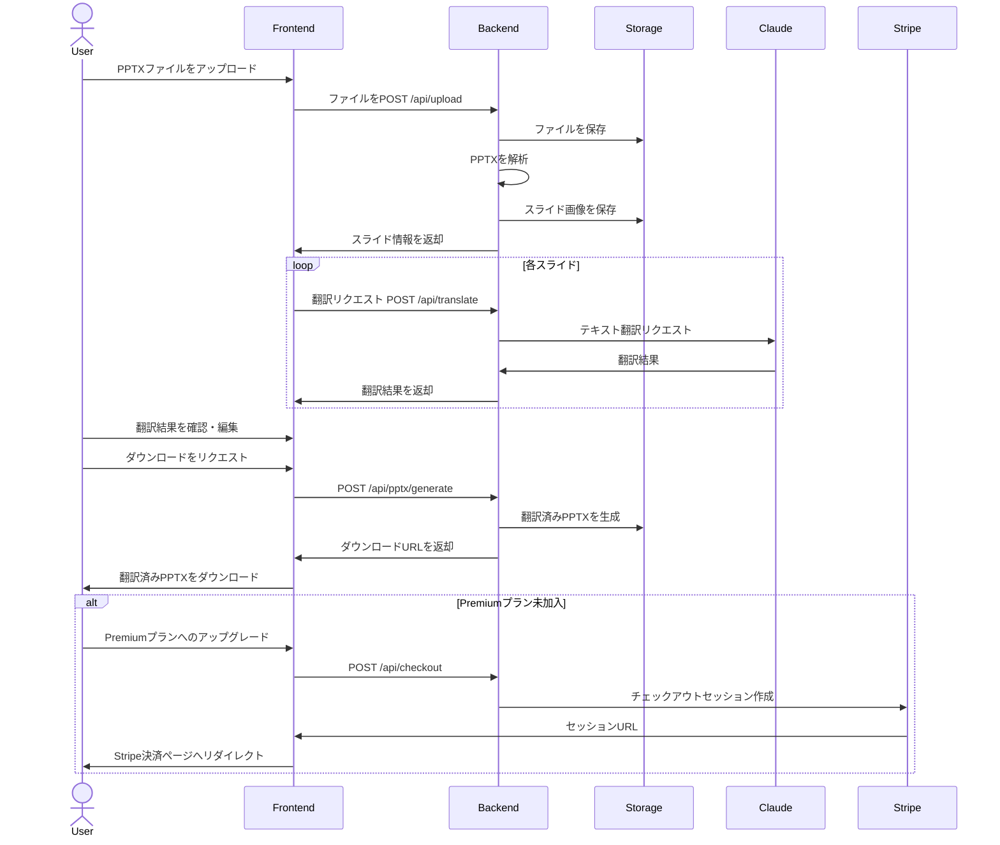
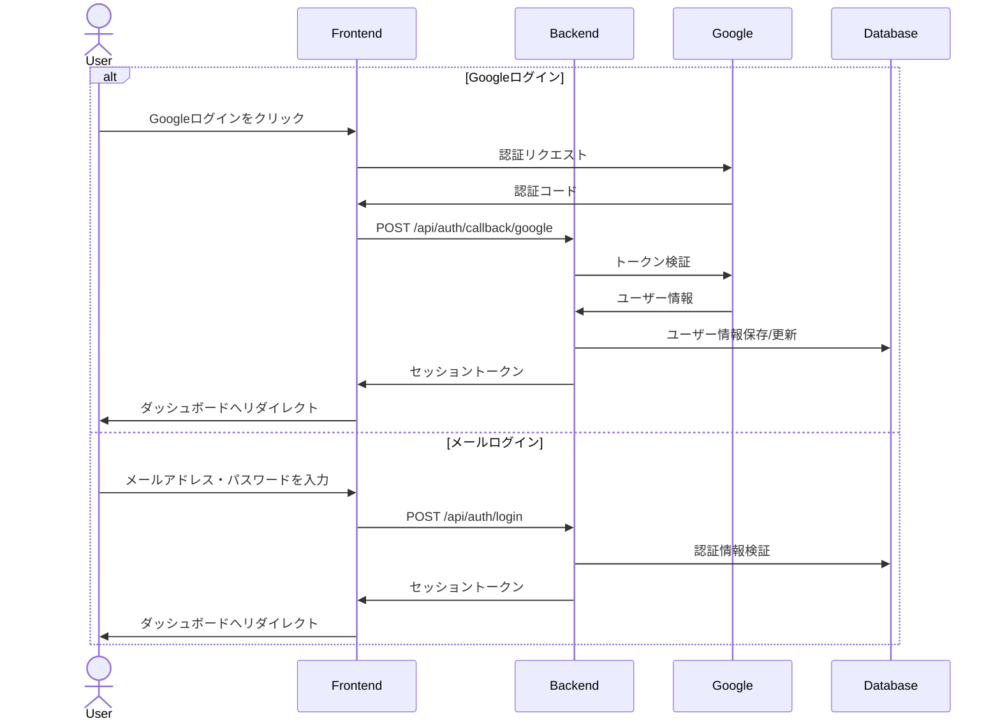

# シーケンス図

## ファイルアップロードと翻訳フロー

```mermaid
sequenceDiagram
    actor User
    participant Frontend
    participant Backend
    participant Storage
    participant Claude
    participant Stripe

    User->>Frontend: PPTXファイルをアップロード
    Frontend->>Backend: ファイルをPOST /api/upload
    Backend->>Storage: ファイルを保存
    Backend->>Backend: PPTXを解析
    Backend->>Storage: スライド画像を保存
    Backend->>Frontend: スライド情報を返却

    loop 各スライド
        Frontend->>Backend: 翻訳リクエスト POST /api/translate
        Backend->>Claude: テキスト翻訳リクエスト
        Claude->>Backend: 翻訳結果
        Backend->>Frontend: 翻訳結果を返却
    end

    User->>Frontend: 翻訳結果を確認・編集
    User->>Frontend: ダウンロードをリクエスト
    Frontend->>Backend: POST /api/pptx/generate
    Backend->>Storage: 翻訳済みPPTXを生成
    Backend->>Frontend: ダウンロードURLを返却
    Frontend->>User: 翻訳済みPPTXをダウンロード

    alt Premiumプラン未加入
        User->>Frontend: Premiumプランへのアップグレード
        Frontend->>Backend: POST /api/checkout
        Backend->>Stripe: チェックアウトセッション作成
        Stripe->>Frontend: セッションURL
        Frontend->>User: Stripe決済ページへリダイレクト
    end
```

## 認証フロー

```mermaid
sequenceDiagram
    actor User
    participant Frontend
    participant Backend
    participant Google
    participant Database

    alt Googleログイン
        User->>Frontend: Googleログインをクリック
        Frontend->>Google: 認証リクエスト
        Google->>Frontend: 認証コード
        Frontend->>Backend: POST /api/auth/callback/google
        Backend->>Google: トークン検証
        Google->>Backend: ユーザー情報
        Backend->>Database: ユーザー情報保存/更新
        Backend->>Frontend: セッショントークン
        Frontend->>User: ダッシュボードへリダイレクト
    else メールログイン
        User->>Frontend: メールアドレス・パスワードを入力
        Frontend->>Backend: POST /api/auth/login
        Backend->>Database: 認証情報検証
        Backend->>Frontend: セッショントークン
        Frontend->>User: ダッシュボードへリダイレクト
    end
``` 