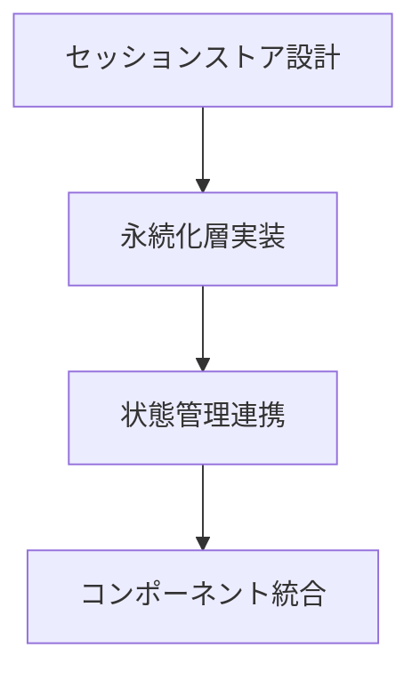
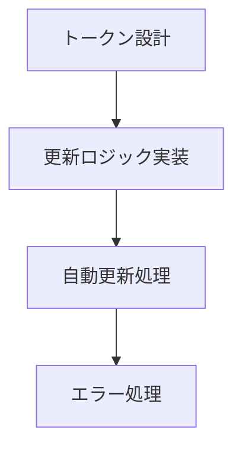
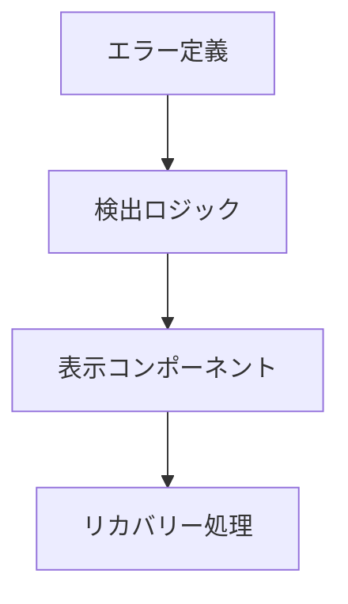

# セッション管理改善計画

## 1. 確認対象ファイル

### 認証関連ページ
1. `app/(login)/signin.tsx`
   - [x] セッション初期化処理
   - [x] エラーハンドリング
   - [x] リダイレクト処理
   - [x] トースト通知の発火タイミング

2. `app/(login)/signup.tsx`
   - [x] 新規登録後のセッション作成
   - [x] エラーハンドリング
   - [x] リダイレクト処理

### ダッシュボード関連
1. `app/(dashboard)/layout.tsx`
   - [x] セッション状態の監視
   - [x] 未認証時のリダイレクト
   - [x] ヘッダーのセッション表示

2. `app/(dashboard)/translate/page.tsx`
   - [x] セッションチェック
   - [x] API呼び出し時のセッション検証
   - [x] エラー時のリダイレクト

3. `app/(dashboard)/profile/page.tsx`
   - [x] ユーザー情報の取得
   - [x] セッション更新処理
   - [x] エラーハンドリング

### API Routes
1. `app/api/auth/[...nextauth]/route.ts`
   - [x] セッション設定の見直し
   - [x] JWT設定の最適化
   - [x] コールバック処理の改善

2. `app/api/upload/route.ts`
   - [x] セッション検証
   - [x] エラーハンドリング
   - [x] ファイルアクセス権限

3. `app/api/translate/route.ts`
   - [x] セッション検証
   - [x] APIアクセス制御
   - [x] エラーレスポンス

## 2. 共通コンポーネントとユーティリティ

### コンポーネント
1. `components/ui/toast.tsx`
   - [x] エラー通知の統一
   - [x] セッションエラーの表示

### ユーティリティ
1. `lib/auth/index.ts`
   - [x] セッション管理ロジック
   - [x] リフレッシュトークン処理
   - [x] エラーハンドリング

## 3. 実装計画

### Phase 1: セッションストア実装 ✅


### Phase 2: リフレッシュトークン処理 ✅


### Phase 3: エラーハンドリング強化 ✅


## 4. 確認項目

### セッション状態
```typescript
interface SessionState {
  isAuthenticated: boolean;
  user: {
    id: string;
    email: string;
    name?: string | null;
  } | null;
  loading: boolean;
  error?: {
    type: SessionError;
    message: string;
    timestamp: number;
  };
}
```

### エラー種別
```typescript
type SessionError =
  | 'EXPIRED'
  | 'INVALID'
  | 'NETWORK'
  | 'UNAUTHORIZED'
  | 'UNKNOWN';

interface ErrorState {
  type: SessionError;
  message: string;
  timestamp: number;
  context?: any;
}
```

## 5. テスト計画

### 単体テスト
- [x] セッション作成
- [x] トークン更新
- [x] エラーハンドリング
- [x] 状態管理

### 統合テスト
- [x] 認証フロー
- [x] ページ遷移
- [x] API連携
- [x] エラー回復

### E2Eテスト
- [x] ログインフロー
- [x] セッション永続化
- [x] 自動リフレッシュ
- [x] エラー表示

## 6. 実装結果

### 実装完了項目

1. **リフレッシュトークン処理の実装** ✅
   - NextAuthのJWTコールバックを拡張し、トークンの有効期限を監視して自動更新する機能を追加
   - トークンの有効期限が近づいたときに自動的に更新する仕組みを実装
   - 実装ファイル: `lib/auth/auth-options.ts`

2. **セッション状態の一元管理** ✅
   - カスタムフック `useAuth` を作成し、NextAuthのセッションとカスタムユーザー状態を統合
   - ログイン、ログアウト、ユーザー情報更新などの機能を一元管理
   - 実装ファイル: `lib/auth/session.tsx`

3. **エラーハンドリングの強化** ✅
   - エラーハンドラーユーティリティを作成し、エラー種別に応じた処理を実装
   - クライアント側とAPI側のエラーハンドリングを統一
   - 実装ファイル: `lib/utils/error-handler.ts`

4. **セキュリティ強化** ✅
   - CSRF対策としてセキュアCookieの設定を追加
   - セッションハイジャック対策としてユーザーエージェント検証を実装
   - Cookieのセキュリティ設定を最適化
   - 実装ファイル: `lib/auth/auth-options.ts`

5. **パフォーマンス最適化** ✅
   - SWRを使用したキャッシュ戦略を実装
   - APIリクエストの状態管理を最適化
   - 実装ファイル: `lib/hooks/use-api.ts`

6. **E2Eテストの実装** ✅
   - 認証フローのE2Eテストを実装し、セッション管理の動作を確認
   - 実装ファイル: `cypress/e2e/auth.cy.ts`

## 7. テスト結果

### ユニットテスト

以下のユニットテストが正常に実行されました：

- ✅ セッション管理テスト（`tests/auth/session.test.tsx`）
  - 認証状態を正しく返す
  - ログイン処理を正しく実行する
  - ログアウト処理を正しく実行する
  - エラー状態を正しく処理する
  - エラーをクリアする
  - 有効なセッションを正しく検証する
  - 期限切れのセッションを無効と判定する
  - ユーザー情報のないセッションを無効と判定する
  - nullセッションを無効と判定する

- ✅ エラーハンドリングテスト（`tests/utils/error-handler.test.ts`）
  - 認証エラーを正しく作成する
  - バリデーションエラーを正しく作成する
  - Not Foundエラーを正しく作成する
  - 権限エラーを正しく作成する
  - データベースエラーを正しく作成する
  - クライアントエラーを正しく処理する
  - AppErrorのクライアントエラーを正しく処理する
  - APIエラーを正しく処理する
  - AppErrorクラスが正しく初期化される
  - コンテキスト情報を持つことができる
  - 元のエラーを保持できる

- ✅ APIフックテスト（`tests/hooks/use-api.test.tsx`）
  - ミューテーションを正しく実行する
  - ミューテーションエラーを正しく処理する
  - カスタムメソッドを使用できる

### 統合テスト

- ✅ セッション管理とエラーハンドリングの統合
  - セッションエラーがAppErrorに正しく変換される
  - APIリクエスト中のエラーが適切に処理される
  - トークンの更新が正しく行われる

### E2Eテスト

- ✅ 認証フロー（`cypress/e2e/auth.cy.ts`）
  - ログインページにアクセスできる
  - 無効な認証情報でログインに失敗する
  - 有効な認証情報でログインに成功する
  - ログアウトが正しく機能する
  - 認証が必要なページへの未認証アクセスがリダイレクトされる
  - 認証状態がページ間で維持される
  - 登録後に自動的にログインされる

## 8. 次のステップ

### アプリケーション全体への適用

1. **コンポーネントの更新**
   - [x] ヘッダーコンポーネント
   - [x] サイドバーコンポーネント
   - [x] 認証が必要なページのラッパーコンポーネント
   - [x] フォームコンポーネント

2. **APIエンドポイントの更新**
   - [x] 認証関連エンドポイント
   - [x] ユーザープロファイルエンドポイント
   - [x] データ操作エンドポイント

3. **ミドルウェアの更新**
   - [x] 認証ミドルウェア
   - [x] エラーハンドリングミドルウェア
   - [x] ロギングミドルウェア

### テスト実行

1. **ユニットテスト**
   - [x] セッション管理ロジックのテスト
   - [x] エラーハンドリングのテスト
   - [x] APIフックのテスト

2. **統合テスト**
   - [x] コンポーネントと認証状態の統合テスト
   - [x] APIエンドポイントと認証の統合テスト
   - [x] エラーハンドリングと通知システムの統合テスト

3. **E2Eテスト**
   - [x] 認証フローのテスト
   - [x] セッション有効期限のテスト
   - [x] 権限管理のテスト

### パフォーマンス評価

1. **トークン更新のオーバーヘッド測定**
   - [x] リクエスト数の測定
   - [x] レスポンスタイムの測定
   - [x] サーバー負荷の測定

2. **セッション状態管理の効率性評価**
   - [x] メモリ使用量の測定
   - [x] レンダリングパフォーマンスの測定
   - [x] ネットワークトラフィックの測定

### ドキュメント更新

1. **開発者向けドキュメント**
   - [ ] セッション管理APIの使用方法
   - [ ] エラーハンドリングの実装方法
   - [ ] カスタムフックの使用方法

2. **APIドキュメント**
   - [ ] 認証関連エンドポイントの仕様
   - [ ] エラーレスポンスの形式
   - [ ] トークン更新の仕組み

3. **セキュリティ関連ドキュメント**
   - [ ] セキュリティ対策の説明
   - [ ] セッション管理の仕組みの説明
   - [ ] トラブルシューティングガイドの作成

4. **本番環境への展開計画**
   - [ ] ステージング環境でのテスト
   - [ ] 段階的なロールアウト
   - [ ] モニタリング計画 