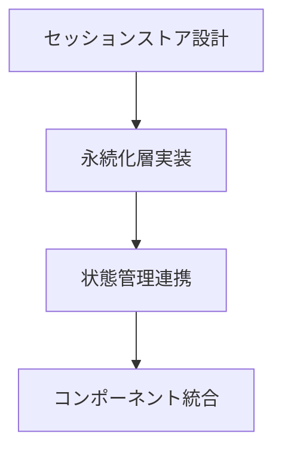
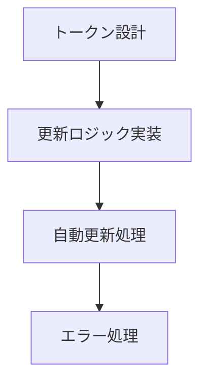
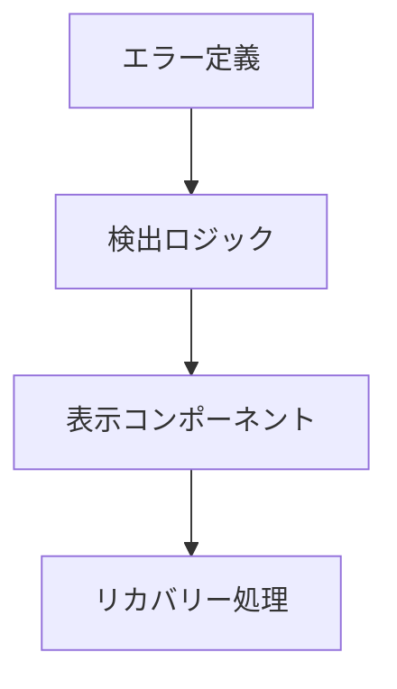

# セッション管理改善計画

## 1. 確認対象ファイル

### 認証関連ページ
1. `app/(login)/signin.tsx`
   - [ ] セッション初期化処理
   - [ ] エラーハンドリング
   - [ ] リダイレクト処理
   - [ ] トースト通知の発火タイミング

2. `app/(login)/signup.tsx`
   - [ ] 新規登録後のセッション作成
   - [ ] エラーハンドリング
   - [ ] リダイレクト処理

### ダッシュボード関連
1. `app/(dashboard)/layout.tsx`
   - [ ] セッション状態の監視
   - [ ] 未認証時のリダイレクト
   - [ ] ヘッダーのセッション表示

2. `app/(dashboard)/translate/page.tsx`
   - [ ] セッションチェック
   - [ ] API呼び出し時のセッション検証
   - [ ] エラー時のリダイレクト

3. `app/(dashboard)/profile/page.tsx`
   - [ ] ユーザー情報の取得
   - [ ] セッション更新処理
   - [ ] エラーハンドリング

### API Routes
1. `app/api/auth/[...nextauth]/route.ts`
   - [ ] セッション設定の見直し
   - [ ] JWT設定の最適化
   - [ ] コールバック処理の改善

2. `app/api/upload/route.ts`
   - [ ] セッション検証
   - [ ] エラーハンドリング
   - [ ] ファイルアクセス権限

3. `app/api/translate/route.ts`
   - [ ] セッション検証
   - [ ] APIアクセス制御
   - [ ] エラーレスポンス

## 2. 共通コンポーネントとユーティリティ

### コンポーネント
1. `components/ui/toast.tsx`
   - [ ] エラー通知の統一
   - [ ] セッションエラーの表示

### ユーティリティ
1. `lib/auth/index.ts`
   - [ ] セッション管理ロジック
   - [ ] リフレッシュトークン処理
   - [ ] エラーハンドリング

## 3. 実装計画

### Phase 1: セッションストア実装


### Phase 2: リフレッシュトークン処理


### Phase 3: エラーハンドリング強化


## 4. 確認項目

### セッション状態
```typescript
interface SessionState {
  isAuthenticated: boolean;
  user: {
    id: string;
    email: string;
    name?: string;
  } | null;
  loading: boolean;
  error?: string;
}
```

### エラー種別
```typescript
type SessionError =
  | 'EXPIRED'
  | 'INVALID'
  | 'NETWORK'
  | 'UNAUTHORIZED'
  | 'UNKNOWN';

interface ErrorState {
  type: SessionError;
  message: string;
  timestamp: number;
  context?: any;
}
```

## 5. テスト計画

### 単体テスト
- [ ] セッション作成
- [ ] トークン更新
- [ ] エラーハンドリング
- [ ] 状態管理

### 統合テスト
- [ ] 認証フロー
- [ ] ページ遷移
- [ ] API連携
- [ ] エラー回復

### E2Eテスト
- [ ] ログインフロー
- [ ] セッション永続化
- [ ] 自動リフレッシュ
- [ ] エラー表示 