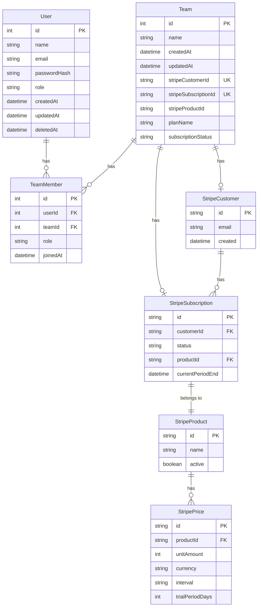

# Stripe Integration Documentation

## Setup
- Stripe APIキーの設定
- Webhookの設定
- 製品・価格の設定

## Implementation
- サブスクリプションフロー
- 支払い処理
- 請求管理
- 定期支払い

## Webhooks
- 支払いステータス更新
- サブスクリプション状態管理
- 失敗時のリトライ処理

## Testing
- テスト用APIキー
- テストモードでの動作確認

## ファイル構造
```lib/stripe```
- `stripe.ts`: Stripeクライアントの初期化と基本設定
- `subscription.ts`: サブスクリプション関連のヘルパー関数

```app/api/webhooks```
- `route.ts`: Stripeからのwebhookを処理

``[app/api/stripe](cci:7://file:///Users/yusuketsunoda/Desktop/Practice/cursor/saas-starter-main/app/api/stripe:0:0-0:0)``
- `create-checkout.ts`: チェックアウトセッション作成
- `create-portal.ts`: カスタマーポータルセッション作成

## 主要な実装

### 1. Stripe設定
```typescript
// 環境変数
STRIPE_SECRET_KEY=sk_test_...
STRIPE_WEBHOOK_SECRET=whsec_...
STRIPE_PRICE_ID=price_...


2. サブスクリプション機能
プランの選択
チェックアウトフロー
支払い処理
サブスクリプション管理
3. Webhookハンドラー
以下のイベントを処理:

customer.subscription.created
customer.subscription.updated
customer.subscription.deleted
checkout.session.completed
4. 課金ポータル
ユーザーが支払い方法を管理
サブスクリプションのアップグレード/ダウングレード
請求履歴の確認
セキュリティ
Webhook署名の検証
APIキーの安全な管理
環境変数による機密情報の保護
テスト
テストモード用のAPIキー
テスト用カード番号:
成功: 4242 4242 4242 4242
失敗: 4000 0000 0000 0002
エラーハンドリング
支払い失敗時の処理
webhook再試行メカニズム
エラーログの記録
価格設定
複数プランのサポート
定期支払いの設定
試用期間の設定
実装のベストプラクティス
webhookの冪等性の確保
非同期処理の適切な実装
データベースとの整合性維持
エラー時のフォールバック処理

## ER Diagram



このER図は以下の関係を示しています：

1. **アプリケーションのデータベース**
   - `User`: アプリケーションのユーザー
   - `Team`: チーム情報とStripe関連の参照情報
   - `TeamMember`: ユーザーとチームの関連付け

2. **Stripeシステム（外部）**
   - `StripeCustomer`: Stripeの顧客情報
   - `StripeSubscription`: サブスクリプション情報
   - `StripeProduct`: 製品情報
   - `StripePrice`: 価格情報

3. **主要な関係性**
   - チームはStripeCustomerとStripeSubscriptionを持つ
   - StripeCustomerは複数のSubscriptionを持つことが可能
   - StripeSubscriptionは特定のProductに紐付く
   - StripeProductは複数のPriceを持つことが可能