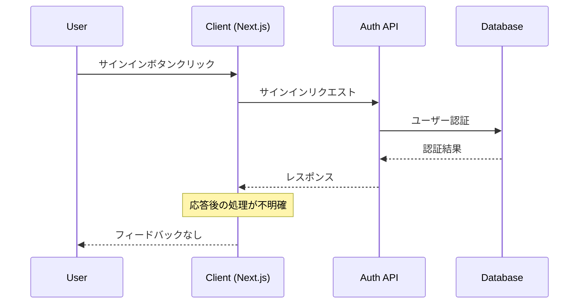
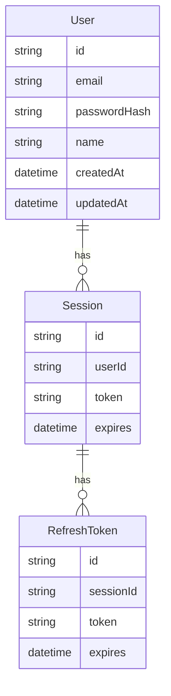
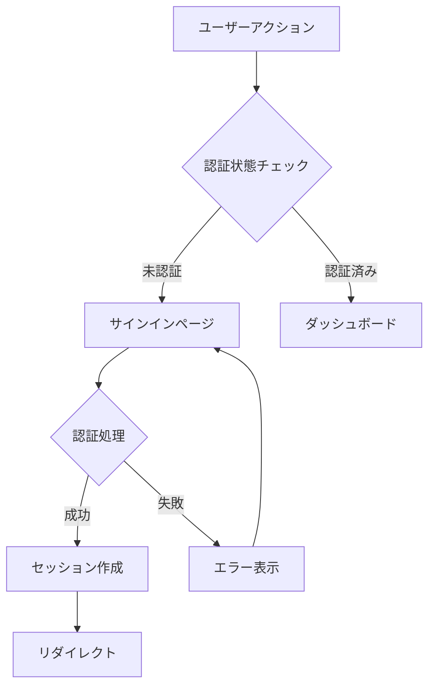
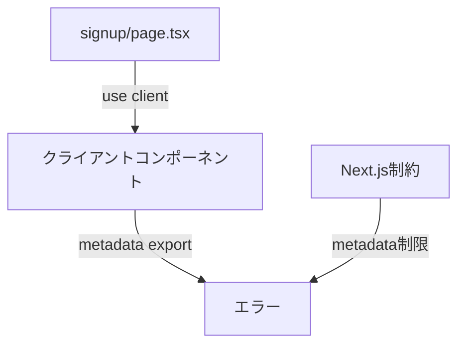
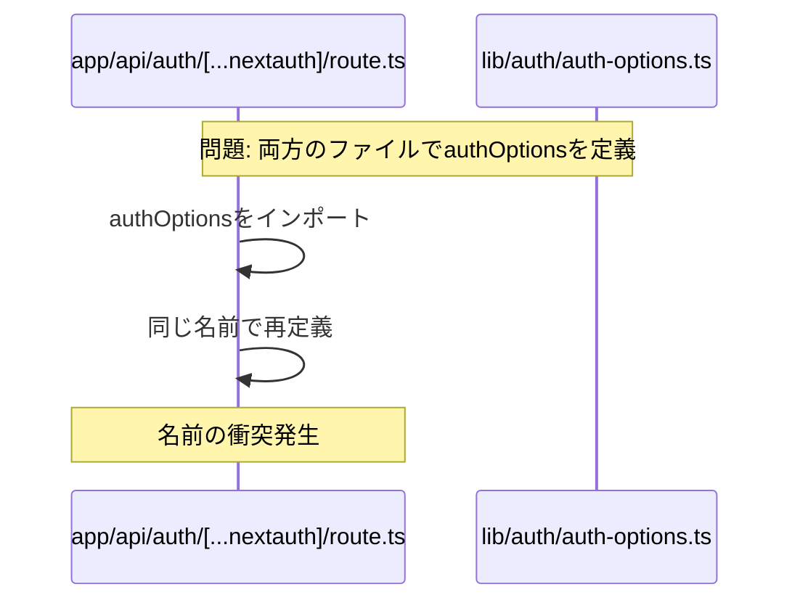
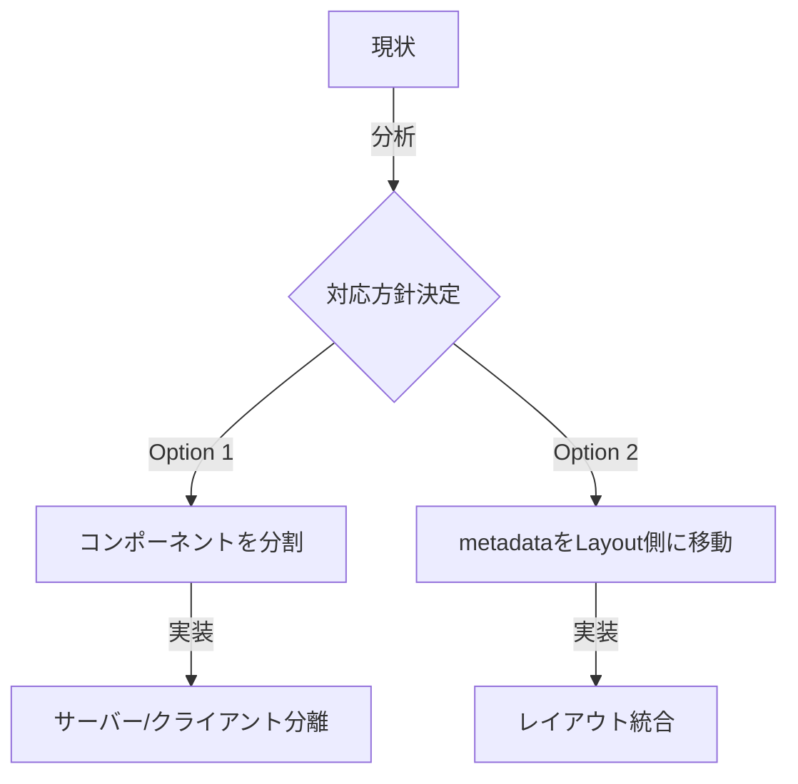
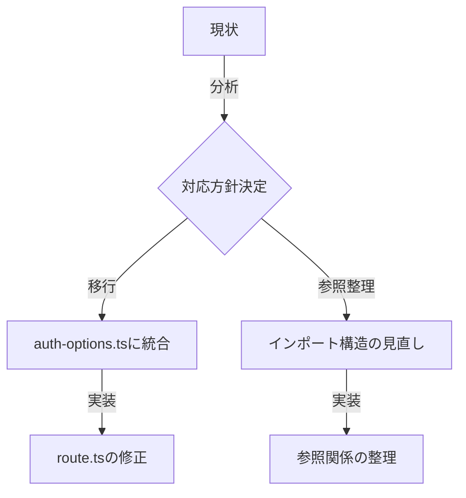
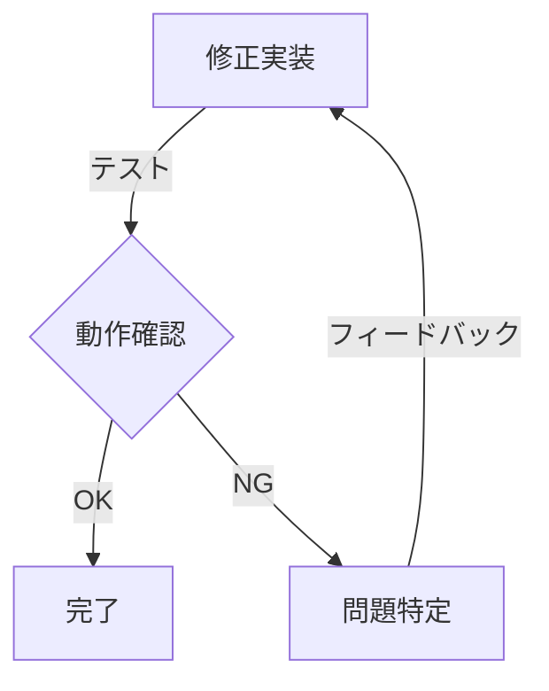
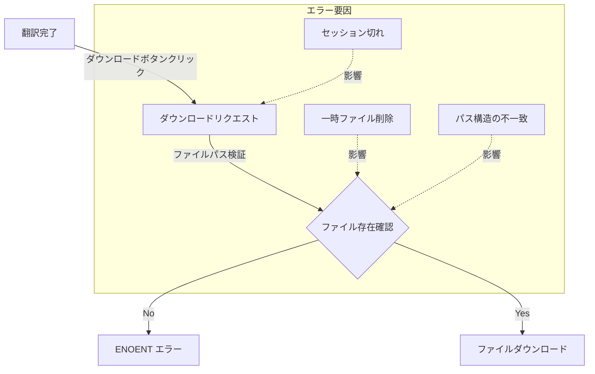
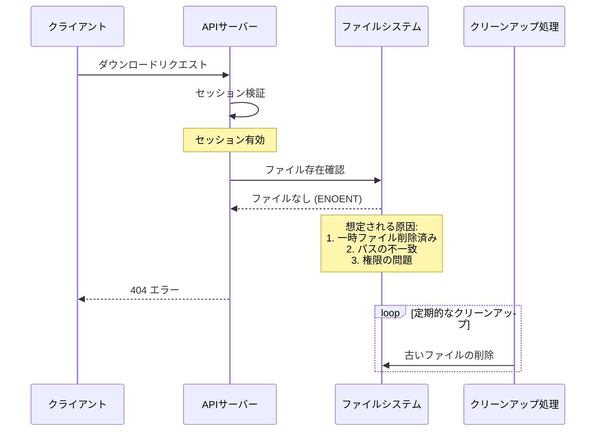

# タスクリスト

## 優先度: 高
- [ ] マウスクリックが動作しない問題の修正
- [ ] 翻訳履歴機能の実装
- [x] チーム管理機能の実装
- [x] アクティビティログの実装
- [x] エラーハンドリングの改善
- [ ] パフォーマンス最適化

## 優先度: 中
- [ ] ダークモードの実装
- [ ] バッチ翻訳機能の実装
- [x] プロフィール編集機能の実装
- [ ] API連携機能の実装
- [ ] 請求書生成機能の実装
- [ ] 統計・分析機能の実装

## 優先度: 低
- [ ] ブログ機能の実装
- [ ] ドキュメント機能の実装
- [ ] 多言語対応の拡充
- [ ] カスタムテーマ機能
- [ ] APIドキュメントの整備
- [ ] E2Eテストの拡充

## バグ修正
- [ ] ログイン後のイベント伝播問題
- [ ] ファイルアップロード時のエラー処理
- [ ] 翻訳テキストの位置ずれ
- [ ] セッション切れの処理改善
- [ ] メモリリークの対応

## 技術的負債
- [x] NextAuth.js v5への移行
- [x] 型定義の整備
- [x] コンポーネントのリファクタリング
- [ ] テストカバレッジの向上
- [x] ログ出力の統一

## セキュリティ対策
- [x] CSRF対策の強化
- [x] レート制限の実装
- [x] ファイルアクセス制御の改善
- [x] セッション管理の強化
- [x] 監査ログの拡充

## データベース改善
- [x] ENUM型の導入
  - [x] ユーザーロール
  - [x] サブスクリプションステータス
  - [x] ファイルステータス
  - [x] 言語コード
- [x] インデックスの最適化
  - [x] 検索頻度の高いカラムの特定
  - [x] 複合インデックスの設計
  - [x] インデックスのパフォーマンス計測
- [x] トリガーの実装
  - [x] updated_at自動更新
  - [x] 監査ログ自動記録
  - [x] 古いデータの自動アーカイブ
- [ ] RLS（Row Level Security）の実装
  - [ ] テーブルごとのポリシー設定
  - [ ] ロールベースのアクセス制御
  - [ ] 監査ログの自動記録

## Supabase連携
### Phase 1: 基本設定とデータベース移行
- [ ] Supabase プロジェクトのセットアップ
  - [ ] プロジェクト作成
  - [ ] 環境変数の設定
  - [ ] Vercelとの連携設定

- [ ] データベーススキーマの移行
  - [ ] ENUMの定義
    - [ ] ActivityAction
    - [ ] SubscriptionStatus
    - [ ] FileStatus
    - [ ] LanguageCode
    - [ ] UserRole
  - [ ] テーブルの作成
    - [ ] users
    - [ ] teams
    - [ ] team_members
    - [ ] subscriptions
    - [ ] activity_logs
    - [ ] files
    - [ ] slides
    - [ ] texts
    - [ ] translations
    - [ ] translation_memory
    - [ ] glossary
  - [ ] リレーションの設定
  - [ ] インデックスの作成
  - [ ] RLSポリシーの設定

### Phase 2: 認証・認可の実装
- [ ] Supabase Auth設定
  - [ ] メール認証の設定
  - [ ] Google認証の設定
  - [ ] パスワードリセットフロー
  - [ ] 招待フロー
- [ ] RLSポリシーの実装
  - [ ] チームベースのアクセス制御
  - [ ] ロールベースの権限管理
  - [ ] ファイルアクセス制御

### Phase 3: ストレージ実装
- [ ] Supabase Storageバケットの設定
  - [ ] PPTXファイル用バケット
  - [ ] スライド画像用バケット
  - [ ] 一時ファイル用バケット
- [ ] ストレージポリシーの設定
  - [ ] アップロード制限
  - [ ] アクセス制御
  - [ ] 有効期限設定
- [ ] ファイル管理機能の実装
  - [ ] アップロード処理
  - [ ] ダウンロード処理
  - [ ] 一時URL生成
  - [ ] 自動クリーンアップ

### Phase 4: リアルタイム機能実装
- [ ] Supabase Realtimeの設定
  - [ ] チャンネル設定
  - [ ] イベント定義
- [ ] リアルタイム更新の実装
  - [ ] 翻訳状態の同期
  - [ ] チーム活動の同期
  - [ ] ファイル処理状態の同期
- [ ] プレゼンス機能の実装
  - [ ] オンラインステータス
  - [ ] 同時編集管理

### Phase 5: Edge Functions実装
- [ ] Webhook処理の実装
  - [ ] Stripe Webhook
  - [ ] ファイル処理Webhook
- [ ] バッチ処理の実装
  - [ ] 定期クリーンアップ
  - [ ] 使用統計集計
  - [ ] バックアップ処理
- [ ] カスタムAPI実装
  - [ ] 翻訳処理API
  - [ ] ファイル変換API
  - [ ] 統計レポートAPI

### Phase 6: パフォーマンスとモニタリング
- [ ] キャッシュ戦略の実装
  - [ ] クエリキャッシュ
  - [ ] ストレージキャッシュ
  - [ ] Edge Caching
- [ ] モニタリングの設定
  - [ ] パフォーマンスモニタリング
  - [ ] エラー監視
  - [ ] 使用量監視
- [ ] バックアップと復旧
  - [ ] 自動バックアップ
  - [ ] ポイントインタイム復旧
  - [ ] 障害復旧手順

### Phase 7: デプロイメントとCI/CD
- [ ] Vercelデプロイメント設定
  - [ ] 環境変数設定
  - [ ] ビルド設定
  - [ ] デプロイメントフック
- [ ] CI/CDパイプライン構築
  - [ ] テスト自動化
  - [ ] デプロイ自動化
  - [ ] マイグレーション自動化

# 認証関連の問題点と修正Todo

## 1. サインイン処理の問題

### 現在の問題
- サインインボタンを押しても反応がない
- 成功/失敗の状態がユーザーに伝わらない
- リダイレクトが正しく機能していない

### シーケンス図（現状）


### 原因分析
1. クライアントサイドの状態管理
   - `app/(login)/signin.tsx`でのエラーハンドリングが不完全
   - トースト通知の実装はあるが、正しく発火していない可能性

2. 認証フロー
   - `app/api/auth/[...nextauth]/route.ts`でのセッション管理が不完全
   - JWTの検証とセッションの更新タイミングに問題の可能性

3. リダイレクト処理
   - `app/(marketing)/page.tsx`のリンク先が`/signin`と`/sign-in`で不一致
   - Next.jsのルーティング設定との齟齬

### 修正履歴
1. ✅ トースト通知の追加
   - 成功: 通知コンポーネントの実装
   - 課題: 発火タイミングの調整が必要

2. ✅ パス統一
   - 成功: `/signin`に統一
   - 課題: 他のファイルでの参照確認が必要

3. ❌ セッション管理の改善
   - 試行: エラーハンドリングの強化
   - 失敗: セッションの永続化に問題が残存

### 必要な情報・確認項目
1. セッション管理
   ```typescript
   // 確認が必要な情報
   interface SessionInfo {
     tokenExpiry: number;
     refreshToken: string;
     sessionStatus: 'active' | 'expired';
   }
   ```

2. ルーティング設定
   - Next.jsの設定ファイル
   - ミドルウェアの設定状態

3. クライアントの状態
   - Reactコンポーネントのマウント状態
   - イベントハンドラの発火状況

## 2. 改善のためのプロンプト設計

### システム状態の確認プロンプト
```typescript
// 認証状態の確認
const checkAuthState = {
  sessionValid: boolean;
  tokenExpiry: number;
  lastAction: string;
  errorLogs: string[];
};

// ルーティング状態の確認
const checkRoutingState = {
  currentPath: string;
  intendedRedirect: string;
  middlewareActive: boolean;
};
```

### 推奨プロンプトテンプレート
1. 認証フローの確認
   ```
   現在の認証フローについて：
   1. セッションの状態: [status]
   2. 最後のアクション: [action]
   3. エラーログ: [logs]
   4. リダイレクト先: [destination]
   ```

2. ユーザーフィードバックの確認
   ```
   ユーザーインターフェースの状態：
   1. ローディング表示: [status]
   2. エラーメッセージ: [message]
   3. トースト通知: [status]
   4. リダイレクト処理: [status]
   ```

## 3. 次のステップ

### 優先度の高いタスク
1. セッション管理の改善
   - [ ] セッションストアの実装
   - [ ] リフレッシュトークンの処理
   - [ ] エラーハンドリングの強化

2. ユーザーフィードバックの強化
   - [ ] ローディング状態の表示
   - [ ] エラーメッセージの明確化
   - [ ] 成功時の通知改善

3. ルーティングの整理
   - [ ] パスの統一
   - [ ] ミドルウェアの設定確認
   - [ ] リダイレクト処理の改善

### 必要なドキュメント
1. 認証フローの設計図
2. エラーハンドリングのフローチャート
3. ユーザーフィードバックのワイヤーフレーム

## 4. ER図（認証関連）


## 5. 認証フロー図


# 認証関連のエラー分析

## 1. エラー内容

### エラー1: `metadata` export エラー
```
Error: You are attempting to export "metadata" from a component marked with "use client", which is disallowed.
```

### エラー2: `authOptions` 重複定義エラー
```
Error: the name `authOptions` is defined multiple times
```

## 2. エラーの原因分析

### エラー1: クライアントコンポーネントでのmetadata定義


#### 原因の詳細
1. `use client`ディレクティブが付いたコンポーネントは完全にクライアントサイドで実行
2. `metadata`はサーバーサイドでのみ定義可能
3. この制約に違反しているため、ビルドエラーが発生

### エラー2: authOptionsの二重定義


#### 原因の詳細
1. `lib/auth/auth-options.ts`で定義
2. `app/api/auth/[...nextauth]/route.ts`で再定義
3. 同じスコープ内での重複定義によりエラー

## 3. 修正計画

### Phase 1: metadata対応


#### 対応手順
1. `signup/page.tsx`の構造見直し
   - [ ] `use client`の必要性確認
   - [ ] metadataの配置場所変更
   - [ ] コンポーネント分割検討

### Phase 2: authOptions重複解決


#### 対応手順
1. ファイル構成の整理
   - [ ] `lib/auth/auth-options.ts`を単一の定義元として確立
   - [ ] `route.ts`から重複定義を削除
   - [ ] インポートパスの整理

### Phase 3: テストと検証


#### 検証項目
1. ビルド確認
   - [ ] 開発環境でのビルド
   - [ ] 本番環境でのビルド
2. 機能テスト
   - [ ] 認証フロー
   - [ ] メタデータ表示
   - [ ] ルーティング

## 4. 実装の優先順位

### 優先度: 高
- [ ] authOptions重複定義の解決
  - アプリケーション全体の認証に影響
  - ビルドブロッカーの解消

### 優先度: 中
- [ ] metadata配置の修正
  - SEO影響あるが、一時的な回避策可能

### 優先度: 低
- [ ] コンポーネント構造の最適化
- [ ] テストカバレッジの向上

## 5. 原因の特定と修正計画

### 5.1 問題の根本原因
- NextAuthの設定ファイルでの不一致が`/auth/signin`へのリダイレクトを引き起こしている
- LPページやNext.jsルーターの実装は正しく`/signin`を参照している

### 5.2 修正が必要なファイル
1. `lib/auth/auth-options.ts`
2. `lib/auth/auth.ts`
3. `auth.ts`

### 5.3 修正内容
```typescript
// すべての認証設定ファイルで統一する設定
pages: {
  signIn: '/signin',
  signOut: '/signin',
  error: '/signin',
}
```

### 5.4 修正手順
1. 各設定ファイルの`pages`オプションを確認
2. すべての`signIn`パスを`/signin`に統一
3. 関連する`signOut`と`error`パスも同様に修正
4. 開発サーバーの再起動
5. 動作確認

### 5.5 確認項目
- [ ] すべての設定ファイルでパスが統一されている
- [ ] リダイレクトが正しく機能する
- [ ] 404エラーが発生しない
- [ ] 認証フローが正常に動作する

# 現在の課題分析

## 1. Prismaのインポート問題

### 現状の課題
1. `app/api/auth/login/route.ts`でのインポートエラー
2. `app/api/subscription/route.ts`での型エラー
3. `app/api/translations/save/route.ts`でのPrismaクライアント初期化の重複

### MVPのための修正計画

#### Phase 1: Prismaインポートの統一
1. 認証関連
   ```typescript
   // app/api/auth/login/route.ts
   import { prisma } from '@/lib/db/prisma';
   ```

2. 翻訳関連
   ```typescript
   // app/api/translations/save/route.ts
   import { prisma } from '@/lib/db/prisma';
   ```

#### Phase 2: 型定義の適用
1. ユーザー関連の型
   ```typescript
   import { PrismaUser } from '@/types/prisma';
   ```

2. 翻訳関連の型
   ```typescript
   import { PrismaTranslation } from '@/types/prisma';
   ```

#### Phase 3: エラーハンドリング強化
1. データベースエラー
   ```typescript
   try {
     await prisma.$connect();
   } catch (error) {
     // エラーログと適切なレスポンス
   }
   ```

2. トランザクション処理
   ```typescript
   await prisma.$transaction(async (tx) => {
     // トランザクション処理
   });
   ```

### 優先順位
1. 高優先度
   - [x] Prismaクライアントの一元管理
   - [ ] 認証APIでの型適用
   - [ ] 翻訳APIでの型適用

2. 中優先度
   - [ ] エラーハンドリングの実装
   - [ ] トランザクション処理の追加

### 影響範囲
- ✅ ユーザー認証（サインイン/サインアップ）
- ✅ 翻訳機能（保存/読み込み）
- ❌ サブスクリプション（MVP後で実装）


# ファイルアクセスエラーの分析と対応策

## エラー内容
```
Error: ENOENT: no such file or directory, access '/Users/.../tmp/users/{userId}/uploads/{fileId}_original.pptx'
```

## エラーの原因分析

### 1. 発生シナリオ


### 2. エラーフロー詳細


## 推定される原因

1. **一時ファイルの管理の問題**
   - 一時ファイルが予期せず削除されている
   - クリーンアップ処理のタイミングが不適切
   - ファイルの保持期間が短すぎる

2. **パス構造の不一致**
   - 保存時とダウンロード時でパスの構造が異なる
   - 相対パスと絶対パスの混在
   - プラットフォーム間のパス区切り文字の違い

3. **セッション管理の問題**
   - セッションとファイルの紐付けが不完全
   - ユーザーIDの不一致
   - セッション有効期限との同期不足

## 必要な対応

### 1. 一時ファイル管理の改善
- [ ] 一時ファイルの保持期間を適切に設定
  ```typescript
  const FILE_RETENTION_PERIOD = 24 * 60 * 60 * 1000; // 24時間
  ```
- [ ] クリーンアップ処理のロギング強化
- [ ] ファイル削除前の存在確認と使用状況チェック

### 2. パス管理の統一
- [ ] パス生成ユーティリティの作成
  ```typescript
  export function createFilePath(userId: string, fileId: string): string {
    return path.join('tmp', 'users', userId, 'uploads', `${fileId}_original.pptx`);
  }
  ```
- [ ] 相対パスと絶対パスの変換処理の一元化
- [ ] プラットフォーム非依存のパス処理の実装

### 3. エラーハンドリングの強化
- [ ] 詳細なエラーメッセージの実装
- [ ] リトライメカニズムの追加
- [ ] ファイルの自動再生成オプションの検討

### 4. 監視とロギングの改善
- [ ] ファイル操作のログ強化
  ```typescript
  interface FileOperationLog {
    operation: 'create' | 'delete' | 'access';
    userId: string;
    fileId: string;
    timestamp: Date;
    success: boolean;
    error?: string;
  }
  ```
- [ ] メトリクスの収集
  - ファイル作成・削除の頻度
  - エラー発生率
  - ストレージ使用量

### 5. テスト強化
- [ ] ファイル操作のユニットテスト追加
- [ ] エッジケースのテストケース追加
  - 同時アクセス
  - 大容量ファイル
  - ネットワーク遅延

## 実装の優先順位

1. 緊急対応（Day 1）
   - ファイル存在確認の強化
   - エラーメッセージの改善
   - ログ出力の強化

2. 短期対応（Week 1）
   - パス管理の統一
   - クリーンアップ処理の改善
   - 基本的なエラーハンドリング

3. 中期対応（Month 1）
   - 監視システムの実装
   - テストケースの追加
   - ドキュメントの更新

## 技術的な注意点

1. ファイルシステムの操作
```typescript
// 非同期処理の適切な使用
async function checkAndCreatePath(filePath: string): Promise<void> {
  try {
    await fs.access(filePath);
  } catch (error) {
    if (error.code === 'ENOENT') {
      await fs.mkdir(path.dirname(filePath), { recursive: true });
    }
  }
}
```

2. エラーハンドリング
```typescript
// 詳細なエラー情報の提供
interface FileError extends Error {
  code: string;
  path: string;
  operation: string;
}

function createFileError(error: Error, operation: string): FileError {
  return {
    ...error,
    operation,
    message: `File operation failed: ${operation} - ${error.message}`
  };
}
```

3. セッション管理
```typescript
// セッションとファイルの紐付け
interface FileSession {
  userId: string;
  fileId: string;
  createdAt: Date;
  expiresAt: Date;
  path: string;
}
```

この分析と対応策により、ファイルアクセスエラーの発生を防ぎ、より安定したファイル管理システムを実現できます。

# ダウンロード処理のシーケンスと問題点

1. ユーザーがダウンロードボタンを押す
   - ダウンロード API（例: /api/download/route.ts）が呼び出される

2. セッション検証とリクエストデータの検証
   - ユーザーIDやファイルIDなどを取得

3. **ファイルパスの生成と検証**
   - 現在、`createFilePath()` で生成されるのはアップロードされた元ファイルのパス
   - そのため、verifyAndGetFile() で存在確認を行う対象が「元ファイル」になっている
   - → **問題点**: 翻訳後の修正ファイル（たとえば `translated_*.pptx`）のパスを使用する必要がある

4. Python スクリプトの実行
   - 翻訳処理が行われ、翻訳内容を反映した修正ファイルが生成される（`outputFilePath`）
   - ※生成が正常であれば outputFilePath にファイルがあるはず

5. ファイルアクセス処理
   - 出力ファイルの存在確認をしてから、返却用の相対パスを生成
   - → **問題点**: 現在の検証パスが元ファイルとなっており、存在しないためエラー（ENOENT）が発生する

6. ログ記録（ActivityLog の作成）
   - ログ作成時に `action: "file_access"` としているが、Prisma の `ActivityAction` enum には適合しない可能性がある
   - → **問題点**: スキーマに合わせた値（例えば "FILE_ACCESS"）に変更する必要がある
